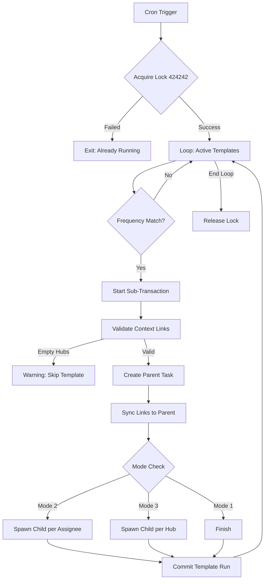
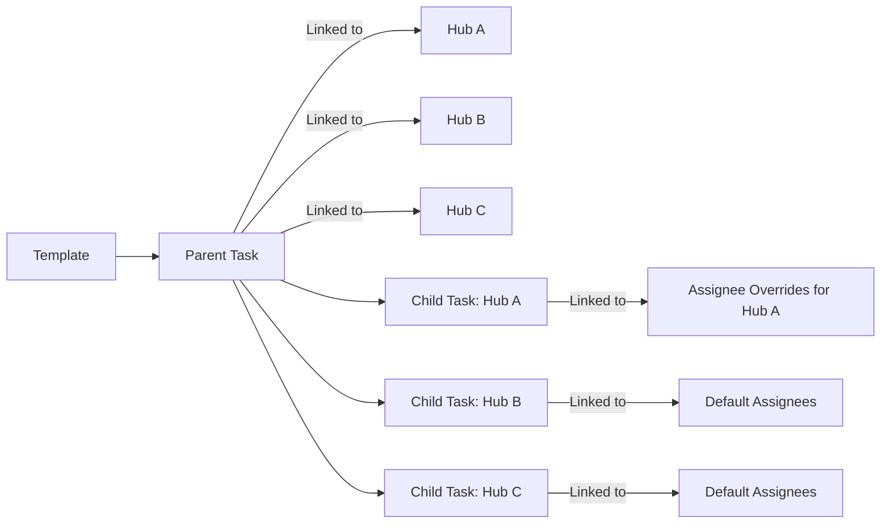

# Runbook 3.2 — The Atomic Generator Spawner (Hardened Engine)

## Phase 3: Generator Fan-Out
## Subphase 3.2: Implementation of the Robust, Multi-Mode Spawning Engine

---

## 1. Conceptual Deep-Dive: The Polymorphic Dispatcher

The `generate_daily_tasks()` function is the "Central Nervous System" of the automated task infrastructure. It transforms static **Templates** (blueprints) into dynamic **Tasks** (actionable units). 

In this architecture, a template doesn't just create a row; it **projects** itself into the `tasks` table using one of three logic modes. This projection ensures that tasks are distributed to the right people, at the right locations, at the right time.

### The Fan-Out Matrix:
| Template Metadata Mode | # of Parent Rows | # of Child Rows | Relationship Logic |
| :--- | :--- | :--- | :--- |
| **Flat (Standard)** | 1 | 0 | One task linked to all Hubs/Assignees associated with the template. |
| **Multi-Assignee** | 1 (System) | N | One Parent Task (Container) + N Child Tasks (One per linked employee). |
| **Multi-Hub** | 1 (System) | M | One Parent Task (Container) + M Child Tasks (One per linked hub). |

---

## 2. Visual Architecture

### 2.1: The Control Flow (Single-Transaction State Machine)


### 2.2: Data Hierarchy (Multi-Hub Example)


---

## 3. Operational Mandates: Reliability Over Throughput

In a mission-critical system, "Partial Generation" or "Duplication" is a blocking defect. This engine implements three levels of protection:

1.  **Mutual Exclusion (Advisory Locks)**: Uses `pg_try_advisory_xact_lock(424242)`. This ensures that even if two cron triggers fire (e.g., overlapping intervals), only one generator processes the queue.
2.  **Error Isolation (Sub-Transactions)**: Every template is processed in a `BEGIN...EXCEPTION` block. If `Template_A` has corrupt JSON, the engine logs a warning and proceeds to `Template_B`. The failure of one template NEVER stops the whole run.
3.  **Idempotency Guard**: Uses `date_trunc('day', ... AT TIME ZONE 'UTC')`. This ensures a task is only generated once per calendar day, regardless of how many times the function is called.

---

## 4. Logic Specification (The "Brain")

### Step 1: Validation & Ghost Parent Protection
- If `has_multiple_hubs` is enabled, the generator scans `task_context_links`.
- If zero **active** hub links are found, it aborts the template run with a `RAISE WARNING`. This prevents "Orphaned Parents" that no one can see.

### Step 2: Parent Creation
- A Parent Task is created as an "Umbrella". 
- It inherits `vertical_id`, `priority`, and `metadata` from the template.
- **Critical**: All active links from the template (Roles, Managers, Hubs) are synced to the Parent for global audit/visibility.

### Step 3: Mode-Specific Branching
- **Mode 2 (Multi-Assignee)**: Loops through every active employee linked to the template and creates a child task.
- **Mode 3 (Multi-Hub)**: Loops through every active hub linked to the template. 
    - **Assignee Override**: If `metadata->'fan_out'->'hub_assignee_map'` contains a key for the hub, it uses those specific IDs. Otherwise, it falls back to the template's default assignees.

---

## 5. Implementation (The Hardened SQL)

**File Path**: `supabase/migrations/20260424104000_phase_3_2_hardened_spawner.sql`

```sql
-- =========================================================================
-- POWERPROJECT: PHASE 3.2 — ATOMIC GENERATOR SPAWNER (FAN-OUT ENGINE)
-- =========================================================================

CREATE OR REPLACE FUNCTION public.generate_daily_tasks()
RETURNS integer
LANGUAGE plpgsql
SECURITY DEFINER
AS $$
DECLARE
    v_lock_acquired  boolean;
    template         RECORD;
    v_parent_id      uuid;
    v_child_id       uuid;
    v_tasks_created  integer := 0;
    v_should_run     boolean;
    v_day_of_week    integer;
    v_fan_out        jsonb;
    v_link           RECORD;
    v_hub_id         uuid;
    v_assignee_ids   uuid[];
    v_active_links   integer;
BEGIN
    -- [GUARD 1: CONCURRENCY]
    -- Global advisory lock prevents race conditions between overlapping cron runs.
    SELECT pg_try_advisory_xact_lock(424242) INTO v_lock_acquired;
    IF NOT v_lock_acquired THEN
        RAISE NOTICE 'Generator already running in another session. Exiting.';
        RETURN 0;
    END IF;

    FOR template IN
        SELECT * FROM public.daily_task_templates 
        WHERE is_active = true 
        ORDER BY priority DESC 
    LOOP
        BEGIN -- [GUARD 2: ERROR ISOLATION SUB-TRANSACTION]
            
            v_should_run := false;

            -- [FREQUENCY STATE MACHINE]
            -- Logic: Idempotent guard ensures only one run per UTC day.
            IF template.frequency = 'DAILY' THEN
                IF template.last_run_at IS NULL
                   OR date_trunc('day', template.last_run_at AT TIME ZONE 'UTC')
                      < date_trunc('day', now() AT TIME ZONE 'UTC') THEN
                    v_should_run := true;
                END IF;
            ELSIF template.frequency = 'WEEKLY' THEN
                v_day_of_week := EXTRACT(DOW FROM now() AT TIME ZONE 'UTC');
                IF (template.frequency_details->>'day_of_week') IS NOT NULL
                   AND (template.frequency_details->>'day_of_week')::int = v_day_of_week THEN
                    IF template.last_run_at IS NULL
                       OR date_trunc('day', template.last_run_at AT TIME ZONE 'UTC')
                          < date_trunc('day', now() AT TIME ZONE 'UTC') THEN
                        v_should_run := true;
                    END IF;
                END IF;
            ELSIF template.frequency = 'MONTHLY' THEN
                IF (template.frequency_details->>'day_of_month') IS NOT NULL
                   AND (template.frequency_details->>'day_of_month')::int
                       = EXTRACT(DAY FROM now() AT TIME ZONE 'UTC') THEN
                    IF template.last_run_at IS NULL
                       OR date_trunc('day', template.last_run_at AT TIME ZONE 'UTC')
                          < date_trunc('day', now() AT TIME ZONE 'UTC') THEN
                        v_should_run := true;
                    END IF;
                END IF;
            END IF;

            IF NOT v_should_run THEN
                CONTINUE;
            END IF;

            -- [GHOST PARENT PROTECTION]
            v_fan_out := COALESCE(template.metadata->'fan_out', '{}'::jsonb);
            
            IF (v_fan_out->>'has_multiple_hubs')::boolean THEN
                SELECT COUNT(*) INTO v_active_links 
                FROM public.task_context_links 
                WHERE source_id = template.id AND entity_type = 'hub' AND is_active = true;
                
                IF v_active_links = 0 THEN
                    RAISE WARNING '[Generator] Template % (%) has multi-hub enabled but 0 active hub links. Skipping.', 
                        template.id, template.title;
                    CONTINUE;
                END IF;
            END IF;

            -- [ACTION 1: SPAWN UMBRELLA PARENT]
            INSERT INTO public.tasks (
                text, description, priority, stage_id, vertical_id,
                hub_id, city, "function", assigned_to,
                user_id, created_by, task_board, metadata
            ) VALUES (
                template.title, template.description, 'Medium', 'TODO', template.vertical_id,
                template.hub_id, template.city, template.function_name, template.assigned_to,
                template.created_by, template.created_by, '["DAILY"]'::jsonb, template.metadata
            ) RETURNING id INTO v_parent_id;

            -- [ACTION 2: SYNC CONTEXT LINKS]
            -- Propagates Roles, Hubs, and standard Assignees to the Parent.
            INSERT INTO public.task_context_links (source_type, source_id, entity_type, entity_id, metadata, is_active)
            SELECT 'task', v_parent_id, entity_type, entity_id, metadata, true
            FROM public.task_context_links
            WHERE source_id = template.id AND source_type = 'template' AND is_active = true;

            -- [ACTION 3: MODE-BASED DISPATCH]
            
            -- MODE 3: MULTI-HUB FAN-OUT
            IF (v_fan_out->>'has_multiple_hubs')::boolean THEN
                FOR v_link IN 
                    SELECT entity_id FROM public.task_context_links 
                    WHERE source_id = template.id AND entity_type = 'hub' AND is_active = true
                LOOP
                    v_hub_id := v_link.entity_id;
                    
                    INSERT INTO public.tasks (
                        text, description, priority, stage_id, vertical_id,
                        hub_id, parent_task_id, task_board
                    ) VALUES (
                        template.title, template.description, 'Medium', 'TODO', template.vertical_id,
                        v_hub_id, v_parent_id, '["DAILY"]'::jsonb
                    ) RETURNING id INTO v_child_id;

                    -- Propagate Governance Roles (Managers/Viewers) to child.
                    INSERT INTO public.task_context_links (source_type, source_id, entity_type, entity_id)
                    SELECT 'task', v_child_id, 'role', entity_id 
                    FROM public.task_context_links 
                    WHERE source_id = template.id AND entity_type = 'role' AND is_active = true;

                    -- Hub-Specific Assignee Mapping (The "Override" Logic)
                    IF v_fan_out ? 'hub_assignee_map' THEN
                       v_assignee_ids := ARRAY(
                           SELECT jsonb_array_elements_text(COALESCE(v_fan_out->'hub_assignee_map'->v_hub_id::text, '[]'::jsonb))::uuid
                       );
                       IF array_length(v_assignee_ids, 1) > 0 THEN
                           INSERT INTO public.task_context_links (source_type, source_id, entity_type, entity_id)
                           SELECT 'task', v_child_id, 'assignee', e.id
                           FROM public.employees e
                           WHERE e.id = ANY(v_assignee_ids) AND e.status = 'Active';
                       END IF;
                    END IF;
                END LOOP;

            -- MODE 2: MULTI-ASSIGNEE FAN-OUT
            ELSIF (v_fan_out->>'has_sub_assignees')::boolean THEN
                 FOR v_link IN 
                    SELECT tcl.entity_id FROM public.task_context_links tcl
                    JOIN public.employees e ON e.id = tcl.entity_id
                    WHERE tcl.source_id = template.id AND tcl.entity_type = 'assignee' 
                      AND tcl.is_active = true AND e.status = 'Active'
                LOOP
                    INSERT INTO public.tasks (
                        text, description, priority, stage_id, vertical_id,
                        hub_id, assigned_to, parent_task_id, task_board
                    ) VALUES (
                        template.title, template.description, 'Medium', 'TODO', template.vertical_id,
                        template.hub_id, v_link.entity_id, v_parent_id, '["DAILY"]'::jsonb
                    );
                END LOOP;
            END IF;

            -- [ACTION 4: MARK COMPLETION]
            UPDATE public.daily_task_templates SET last_run_at = now() WHERE id = template.id;
            v_tasks_created := v_tasks_created + 1;

        EXCEPTION WHEN OTHERS THEN
            RAISE WARNING '[Generator Error] Failed at Template %: %', template.id, SQLERRM;
            -- Sub-transaction rolls back ONLY the failed template.
        END;
    END LOOP;

    RETURN v_tasks_created;
END;
$$;
```

---

## 6. Edge Case & Failure Mode Matrix

| Scenario | System Behavior | Mitigation |
| :--- | :--- | :--- |
| **Hub Deactivated** | Link is still in TCL, but `is_active` check fails. | Task is NOT created for that hub. |
| **Malformed JSONB** | `v_fan_out ? 'field'` syntax protects against missing keys. | Defaulting to `{}` for all JSONB lookups. |
| **Deadlock Risk** | Advisory lock is session-scoped. | Uses `pg_try_advisory_xact_lock` which automatically releases on transaction end. |
| **Ghost Parent** | Mode 3 check ensures Hub links > 0 before creating Parent. | `CONTINUE` loop if 0 links found. |

---

## 7. Advanced Verification (Post-Deployment)

### V3.2.1: Hierarchy Integrity
Verify that for a multi-hub template, the Parent is linked to ALL hubs while children are linked to ONE.
```sql
-- Replace with your Template Title
SELECT 
    t.id, t.text, t.parent_task_id,
    ARRAY_AGG(h.name) as linked_hubs
FROM tasks t
LEFT JOIN task_context_links tcl ON tcl.source_id = t.id AND tcl.entity_type = 'hub'
LEFT JOIN hubs h ON h.id = tcl.entity_id
WHERE t.text = 'Your Template Title'
GROUP BY t.id, t.text, t.parent_task_id;
```

### V3.2.2: Assignee Override Check
```sql
-- Check if children correctly inherited overridden assignees
SELECT 
    t.id, h.name as hub_name,
    ARRAY_AGG(e.full_name) as assignees
FROM tasks t
JOIN hubs h ON h.id = t.hub_id
LEFT JOIN task_context_links tcl ON tcl.source_id = t.id AND tcl.entity_type = 'assignee'
LEFT JOIN employees e ON e.id = tcl.entity_id
WHERE t.parent_task_id IS NOT NULL
GROUP BY t.id, h.name;
```

---

## Next Step → [Runbook 4.1: Hybrid RLS](./06_RLS_MULTI_HUB.md)
