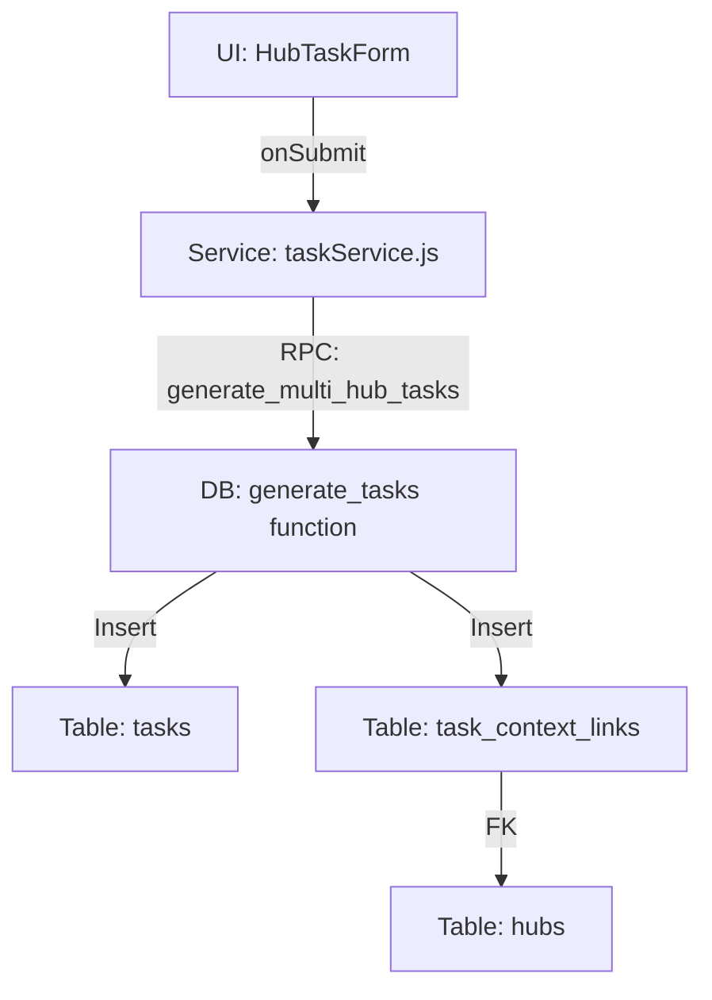

# Runbook 11: Multi-Hub Task Form UI (Extreme Detail Hardening)

## Phase 6: Frontend UI & Interaction Layer
### Subphase 6.1: Multi-Hub Selection, Context Linking & Fan-Out Visualization

---

## 1. Executive Summary & Goal
The objective of this runbook is to refactor the `HubTaskForm.jsx` component from a **Single-Hub Association** model to a **Polymorphic Multi-Hub Association** model. 

By the end of this runbook, the task form will no longer just link a task to one `hub_id`. It will instead:
1.  Support selecting multiple hubs across a city.
2.  Visualize the "Fan-Out" generation logic (predicting how many tasks will be created).
3.  Pass an array of `hub_ids` to the service layer to populate the `task_context_links` junction table.

---

## 2. Architectural Context: Data Flow
To follow this runbook, you must understand how the data travels from the UI to the database:



*   **Legacy Pathway**: `tasks.hub_id` (single UUID).
*   **Modern Pathway**: `task_context_links` (multiple rows linking `task_id` to various `hub_id` values).

---

## 3. The Logic Matrix: Fan-Out Modes
The UI must reactively calculate the "Generation Mode" to inform the user of the consequences of their submission.

| Mode | Input 1 (Hubs) | Input 2 (Assignees) | Logic Description | UI Badge |
| :--- | :--- | :--- | :--- | :--- |
| **Mode 1** | Exact 1 | Exact 1 | **Direct Create**: One task, one hub, one owner. | None |
| **Mode 2** | Exact 1 | 2 or more | **Assignee Fan-Out**: One hub, but separate tasks per person. | `Assignee Split` |
| **Mode 3** | 2 or more | 1 or more | **Hub Fan-Out**: One task per hub. Assignees are copied to each. | `Multi-Hub Mode` |

---

## 4. Prerequisite Validations (DO NOT SKIP)
Before proceeding, run these checks to ensure the foundation is stable:

### 4.1 Schema Check
Ensure the `task_context_links` table exists and is accessible.
```sql
-- Run in Supabase SQL Editor
SELECT count(*) FROM information_schema.tables WHERE table_name = 'task_context_links';
```

### 4.2 Service Layer Check
Ensure `src/services/taskService.js` has been updated to handle `hub_ids` as an array. If it only expects `hub_id`, refer back to **Runbook 08**.

---

## 5. Implementation Steps (Granular Delta)

### Step 5.1: State Object Refactoring
We are moving from a scalar `hub_id` to a collection `hub_ids`.

#### [BEFORE] (Line 16-25)
```javascript
const [formData, setFormData] = useState({
  text: safeData.text || '',
  priority: safeData.priority || 'Medium',
  hub_id: safeData.hub_id || '',
  // ... rest
});
```

#### [AFTER]
```javascript
const [formData, setFormData] = useState({
  text: safeData.text || '',
  priority: safeData.priority || 'Medium',
  // NEW: Initialize from either existing array or legacy single ID
  hub_ids: Array.isArray(safeData.hub_ids) 
    ? safeData.hub_ids 
    : (safeData.hub_id ? [safeData.hub_id] : []),
  city: safeData.city || '',
  function: safeData.function || '',
  description: safeData.description || '',
  assigned_to: Array.isArray(safeData.assigned_to) ? safeData.assigned_to : (safeData.assigned_to ? [safeData.assigned_to] : []),
  parentTask: safeData.parentTask || '',
});
```

---

### Step 5.2: City Change Logic (Edge Case Prevention)
When the user changes the city, the selected hubs must be cleared because hubs are scoped to cities.

#### [MODIFY] `handleCityChange` (Line 79)
```javascript
const handleCityChange = (e) => {
  const newCity = e.target.value;
  setFormData({
    ...formData,
    city: newCity,
    hub_ids: [] // CRITICAL: Reset multi-hub selection on city change
  });
};
```

---

### Step 5.3: Multi-Hub Picker Component
Replace the standard `<select>` with a Tag-Cloud + Dropdown hybrid.

#### [LOCATE] Lines 156-169 in `HubTaskForm.jsx`
#### [REPLACE WITH]
```jsx
<div className="form-group hub-selection-container">
  <label className="form-label-with-badge">
    Target Charging Hub(s)
    {formData.hub_ids.length > 1 && (
      <span className="mode-badge mode-3-badge">🔀 Multi-Hub Generation</span>
    )}
  </label>

  {/* Selection Display (Tags) */}
  <div className="hub-tags-wrapper">
    {formData.hub_ids.length > 0 ? (
      formData.hub_ids.map(hid => {
        const hub = hubs.find(h => h.id === hid);
        return hub ? (
          <div key={hid} className="hub-tag-item anim-scale-in">
            <span className="hub-tag-code">{hub.hub_code || '??'}</span>
            <span className="hub-tag-name">{hub.name}</span>
            <button 
              type="button" 
              className="hub-tag-remove" 
              onClick={() => setFormData(p => ({ ...p, hub_ids: p.hub_ids.filter(id => id !== hid) }))}
              title="Remove Hub"
            >
              &times;
            </button>
          </div>
        ) : null;
      })
    ) : (
      <span className="hub-selection-placeholder">No hubs selected. Tasks will be unlinked.</span>
    )}
  </div>

  {/* Selection Input (Dropdown) */}
  <div className="hub-dropdown-wrapper">
    <select 
      className="master-dropdown hub-selector-input"
      value=""
      onChange={(e) => {
        const val = e.target.value;
        if (val && !formData.hub_ids.includes(val)) {
          setFormData(p => ({ ...p, hub_ids: [...p.hub_ids, val] }));
        }
      }}
      disabled={!formData.city}
    >
      <option value="">{formData.city ? `+ Add Hub from ${formData.city}...` : 'Select City First...'}</option>
      {filteredHubs
        .filter(h => !formData.hub_ids.includes(h.id))
        .map(hub => (
          <option key={hub.id} value={hub.id}>
            [{hub.hub_code}] {hub.name}
          </option>
        ))
      }
    </select>
    <p className="field-help-text">You can select multiple hubs to generate identical tasks for each.</p>
  </div>
</div>
```

---

### Step 5.4: Fan-Out Prediction Visualizer
This box explains the "Magic" happening behind the scenes.

#### [ADD] Before the `form-footer` (Line 250)
```jsx
{/* FAN-OUT PREDICTION LOGIC */}
{(formData.hub_ids.length > 1 || formData.assigned_to.length > 1) && (
  <div className="fanout-prediction-box anim-slide-up">
    <div className="prediction-header">
      <span className="prediction-icon">⚡</span>
      <h4>Automation Insight</h4>
    </div>
    <div className="prediction-content">
      {formData.hub_ids.length > 1 ? (
        <div className="prediction-detail">
          <p><strong>Multi-Hub Mode (Mode 3) Detected:</strong></p>
          <p>This will create <strong>{formData.hub_ids.length}</strong> identical tasks across selected hubs.</p>
          <ul>
            <li>Primary Hub: {hubs.find(h => h.id === formData.hub_ids[0])?.hub_code}</li>
            <li>Total Secondary Links: {formData.hub_ids.length - 1}</li>
          </ul>
        </div>
      ) : formData.assigned_to.length > 1 ? (
        <div className="prediction-detail">
          <p><strong>Assignee Fan-Out (Mode 2) Detected:</strong></p>
          <p>This will create <strong>{formData.assigned_to.length}</strong> tasks (one for each person).</p>
        </div>
      ) : null}
      <p className="prediction-disclaimer">Tasks will be generated as a "Batch" linked to a parent task.</p>
    </div>
  </div>
)}
```

---

### Step 5.5: handleSubmit Payload Refactoring
We must ensure the payload includes both the new array and a "Primary Hub" for backward compatibility.

#### [REPLACE] `handleSubmit` (Line 88-99)
```javascript
const handleSubmit = (e) => {
  e.preventDefault();

  // 1. Resolve primary hub for text formatting
  const primaryHub = hubs.find(h => h.id === formData.hub_ids[0]);
  
  // 2. Format task text using the established utility
  const finalTaskText = taskUtils.formatTaskText(formData.text, {
    assetCode: primaryHub?.hub_code,
    functionName: formData.function,
    forcePrefix: formData.hub_ids.length > 0
  });

  // 3. Construct Payload
  const submissionPayload = {
    ...formData,
    text: finalTaskText,
    // NEW: Pass all selected hubs
    hub_ids: formData.hub_ids, 
    // BACKWARD COMPAT: Set single hub_id to the first selection
    hub_id: formData.hub_ids[0] || null 
  };

  console.log('[HubTaskForm] Submitting Payload:', submissionPayload);
  onSubmit(submissionPayload);
};
```

---

## 6. Premium Styling: `HubTaskForm.css`
The following styles ensure a "Pro" feel with animations and clear hierarchy.

```css
/* Hub Selection Container */
.hub-selection-container {
  border: 1px solid rgba(var(--border-rgb), 0.1);
  padding: 12px;
  border-radius: 12px;
  background: rgba(var(--background-alt-rgb), 0.3);
  margin-bottom: 15px;
}

/* Tag Cloud */
.hub-tags-wrapper {
  display: flex;
  flex-wrap: wrap;
  gap: 8px;
  margin: 10px 0;
  min-height: 40px;
  align-items: center;
}

.hub-tag-item {
  display: flex;
  align-items: center;
  gap: 8px;
  padding: 5px 12px;
  background: linear-gradient(135deg, var(--brand-green), #2ecc71);
  color: white;
  border-radius: 20px;
  font-size: 0.8rem;
  font-weight: 600;
  box-shadow: 0 2px 4px rgba(0,0,0,0.1);
}

.hub-tag-code {
  font-family: 'JetBrains Mono', monospace;
  background: rgba(0,0,0,0.2);
  padding: 2px 6px;
  border-radius: 4px;
  font-size: 0.7rem;
}

.hub-tag-remove {
  background: transparent;
  border: none;
  color: white;
  font-size: 1.2rem;
  cursor: pointer;
  line-height: 1;
  padding: 0;
  margin-left: 4px;
  transition: transform 0.2s;
}
.hub-tag-remove:hover { transform: scale(1.2); color: #ff7675; }

/* Fan-out Prediction Box */
.fanout-prediction-box {
  background: rgba(var(--brand-green-rgb), 0.08);
  border: 1px dashed var(--brand-green);
  border-radius: 12px;
  padding: 15px;
  margin: 20px 0;
}

.prediction-header {
  display: flex;
  align-items: center;
  gap: 10px;
  margin-bottom: 10px;
  color: var(--brand-green);
}
.prediction-header h4 { margin: 0; font-size: 0.95rem; text-transform: uppercase; letter-spacing: 1px; }

.prediction-content p { margin: 4px 0; font-size: 0.88rem; line-height: 1.4; }
.prediction-disclaimer { font-size: 0.75rem; opacity: 0.6; font-style: italic; margin-top: 8px !important; }

/* Animations */
@keyframes scaleIn { from { transform: scale(0.8); opacity: 0; } to { transform: scale(1); opacity: 1; } }
@keyframes slideUp { from { transform: translateY(20px); opacity: 0; } to { transform: translateY(0); opacity: 1; } }

.anim-scale-in { animation: scaleIn 0.3s cubic-bezier(0.175, 0.885, 0.32, 1.275) forwards; }
.anim-slide-up { animation: slideUp 0.4s ease-out forwards; }
```

---

## 7. Verification & Diagnostic Suite

### 7.1 Frontend Console Checks
1.  **Selection Trace**: Add a hub. In the console, verify `formData.hub_ids` now contains 1 UUID.
2.  **Mode Trigger**: Select 2 hubs. Verify the `fanout-prediction-box` appears instantly.
3.  **City Reset**: Change city. Verify `formData.hub_ids` is now `[]`.

### 7.2 Backend Data Integrity (Post-Submission)
After creating a task with 2+ hubs, run this SQL to verify the links:

```sql
-- Check if context links were created for the latest task
SELECT 
    t.text,
    h.hub_code,
    tcl.context_type
FROM tasks t
JOIN task_context_links tcl ON t.id = tcl.task_id
JOIN hubs h ON tcl.context_id = h.id
WHERE t.created_at > now() - interval '5 minutes'
ORDER BY t.created_at DESC;
```

---

## 8. Common Pitfalls & Recovery
*   **Duplicate IDs**: If a user selects the same hub twice, the UI filter in Step 5.3 should prevent it, but double-check the `onChange` logic.
*   **UUID vs String**: Ensure the IDs coming from the `hubs` state are actual UUIDs and not objects.
*   **Legacy Overwrite**: If you forget to include `hub_id: formData.hub_ids[0]`, legacy parts of the app (like old report exports) might break. Always include the "Primary Hub" reference.

---

## Next Steps
- [Runbook 12: Board Hierarchy UI](./12_BOARD_NESTING_UI.md) — Visualizing these tasks in a nested view.
