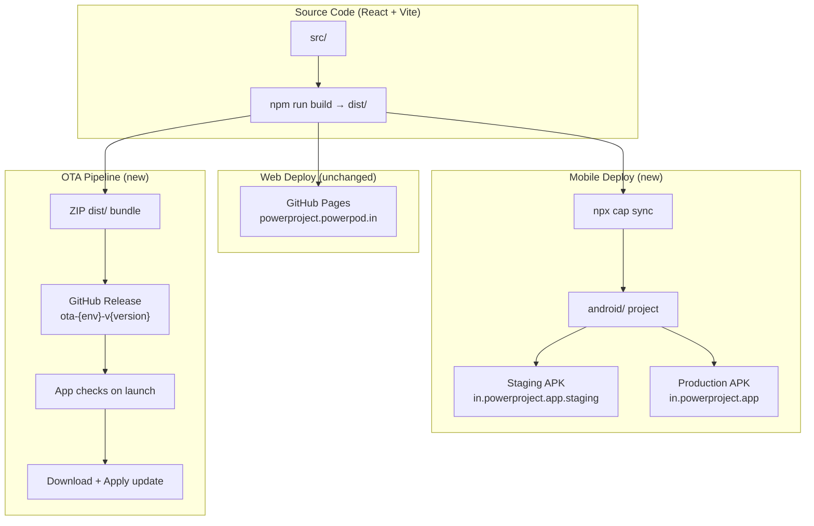

# Hybrid Mobile Deployment — Master Runbook Index

## Goal

Convert the existing **PowerProject** React + Vite web application into a hybrid mobile app using **Capacitor**, with automated CI/CD for APK generation, self-hosted OTA updates via GitHub Releases, and mobile-responsive aesthetics — all without any regressions to the web deployment.

---

## Architecture Overview

---

## Global Rules (All Phases)

> [!CAUTION]
> These rules are **non-negotiable** and apply to every phase. Violating any of them is a blocking failure.

| # | Rule | Source Skill |
|---|------|--------------|
| G1 | **NEVER** use hardcoded hex colors — use CSS variables only | [UI Design System](file:///c:/Users/villy/OneDrive/Documents/PowerPod%20New/Coding%20Practice/PowerProject/.agent/skills/ui-design-system/SKILL.md) |
| G2 | **NEVER** cache Supabase auth/data responses in Service Worker (RBAC/RLS security breach) | [RBAC Security](file:///c:/Users/villy/OneDrive/Documents/PowerPod%20New/Coding%20Practice/PowerProject/.agent/skills/rbac-security-system/SKILL.md) |
| G3 | **EVERY** `async` function MUST have `try/catch` | [Runtime Stability](file:///c:/Users/villy/OneDrive/Documents/PowerPod%20New/Coding%20Practice/PowerProject/.agent/skills/runtime-stability-and-coding-health/SKILL.md) |
| G4 | **EVERY** import MUST be verified — no missing references | [Dev Best Practices](file:///c:/Users/villy/OneDrive/Documents/PowerPod%20New/Coding%20Practice/PowerProject/.agent/skills/development-best-practices/SKILL.md) |
| G5 | Web app on GitHub Pages MUST continue working **identically** — zero regression | — |
| G6 | All mobile CSS MUST be inside `@media` queries — zero desktop impact | [UI Design System §14](file:///c:/Users/villy/OneDrive/Documents/PowerPod%20New/Coding%20Practice/PowerProject/.agent/skills/ui-design-system/SKILL.md) |
| G7 | New components MUST follow halo-button, glassmorphism patterns | [UI Design System §2, §12](file:///c:/Users/villy/OneDrive/Documents/PowerPod%20New/Coding%20Practice/PowerProject/.agent/skills/ui-design-system/SKILL.md) |

---

## Phase Index (Optimized for On-Ground Testing)

| Execution Order | Phase | Name | Runbook Location | Dependencies | Complexity |
|:---:|-------|------|-----------------|--------------|-----------|
| **1st** | **1** | PWA Foundation (Service Worker + Offline Shell) | [phase-1-pwa-foundation.md](file:///c:/Users/villy/OneDrive/Documents/PowerPod%20New/Coding%20Practice/PowerProject/.agent/runbooks_apk/phase-1-pwa-foundation.md) | None | 🟢 LOW |
| **2nd** | **2** | Capacitor Android Project Scaffolding | [phase-2-capacitor-scaffolding.md](file:///c:/Users/villy/OneDrive/Documents/PowerPod%20New/Coding%20Practice/PowerProject/.agent/runbooks_apk/phase-2-capacitor-scaffolding.md) | Phase 1 | 🔴 HIGH |
| **3rd** | **6** | Mobile-Responsive Aesthetics | [phase-6-mobile-responsive.md](file:///c:/Users/villy/OneDrive/Documents/PowerPod%20New/Coding%20Practice/PowerProject/.agent/runbooks_apk/phase-6-mobile-responsive.md) | Phase 1 | 🟢 LOW |
| **4th** | **5** | App Icons & Splash Screen | [phase-5-icons-splash.md](file:///c:/Users/villy/OneDrive/Documents/PowerPod%20New/Coding%20Practice/PowerProject/.agent/runbooks_apk/phase-5-icons-splash.md) | Phase 2 | 🔴 HIGH |
| **5th** | **3** | Self-Hosted OTA Updates (GitHub Releases) | [phase-3-ota-updates.md](file:///c:/Users/villy/OneDrive/Documents/PowerPod%20New/Coding%20Practice/PowerProject/.agent/runbooks_apk/phase-3-ota-updates.md) | Phase 2 | 🟡 MEDIUM |
| **6th** | **4** | GitHub Actions CI/CD Pipeline | [phase-4-cicd-pipeline.md](file:///c:/Users/villy/OneDrive/Documents/PowerPod%20New/Coding%20Practice/PowerProject/.agent/runbooks_apk/phase-4-cicd-pipeline.md) | Phase 3 | 🟢 LOW* |

> [!IMPORTANT]
> **Execution order rationale:** Phase 6 (mobile CSS) is moved up to 3rd position so the **first APK sideloaded onto a phone is actually usable** — without it, you'd be testing desktop CSS crammed into 360px. Phase 5 (icons) follows so staging/production installs are visually distinguishable. Phases 3-4 (OTA + CI/CD) are infrastructure automation and move to last since they're not needed for hands-on device testing.
>
> *Phase 4 complexity is LOW for the model (single YAML file), but HIGH for the human (keystore generation + GitHub Secrets setup).

> [!NOTE]
> **On-Ground Testing Milestone:** After completing Phases 1, 2, and 6, you can build a debug APK (`npm run apk:staging-debug`) and sideload it to a physical device for immediate testing. No OTA, CI/CD, or custom icons are required for this first test cycle.

---

## Deliverables Beyond Phase Runbooks

| # | Deliverable | Description |
|---|-------------|-------------|
| D1 | **New Skill File**: `.agent/skills/hybrid-mobile-deployment/SKILL.md` | Created as part of Phase 2, codifies all hybrid mobile rules |
| D2 | **Updated Skill File**: `.agent/skills/ui-design-system/SKILL.md` — new §14 | Created as part of Phase 6, adds mobile viewport rules |

---

## Verification Plan

### Per-Phase Checkpoints
Each phase runbook ends with a **Checkpoint** section containing exact pass/fail criteria. A phase is not complete until ALL checkpoint items pass.

### End-to-End Validation (After All 6 Phases)
1. `npm run dev` → web app opens at `localhost:5173`, no console errors
2. `npm run build` → production build succeeds, `dist/` contains SW + manifest
3. Web deploy to GitHub Pages → `powerproject.powerpod.in` works identically to before
4. `npx cap sync && cd android && ./gradlew assembleStagingDebug` → Staging APK builds
5. Install Staging APK on device → app loads, auth works, Supabase data shows
6. Install Production APK on same device → both apps appear side-by-side
7. Create a GitHub Release with `ota-staging-v1.0.1` tag → OTA check detects it
8. Mobile viewport at 360px → no horizontal overflow, all touch targets ≥ 44px
9. Desktop viewport at 1440px → zero visual changes from pre-project baseline

---

## Open Questions

> [!IMPORTANT]
> **Android Studio / SDK**: Phase 2 requires the Android SDK to be installed locally for initial project validation. Is Android Studio already installed, or should the runbook include SDK setup instructions?

> [!IMPORTANT]
> **Keystore for Release Signing**: Phase 4 needs a Java keystore for signing release APKs. Should the runbook include keystore generation steps, or will you provide a pre-existing keystore?
