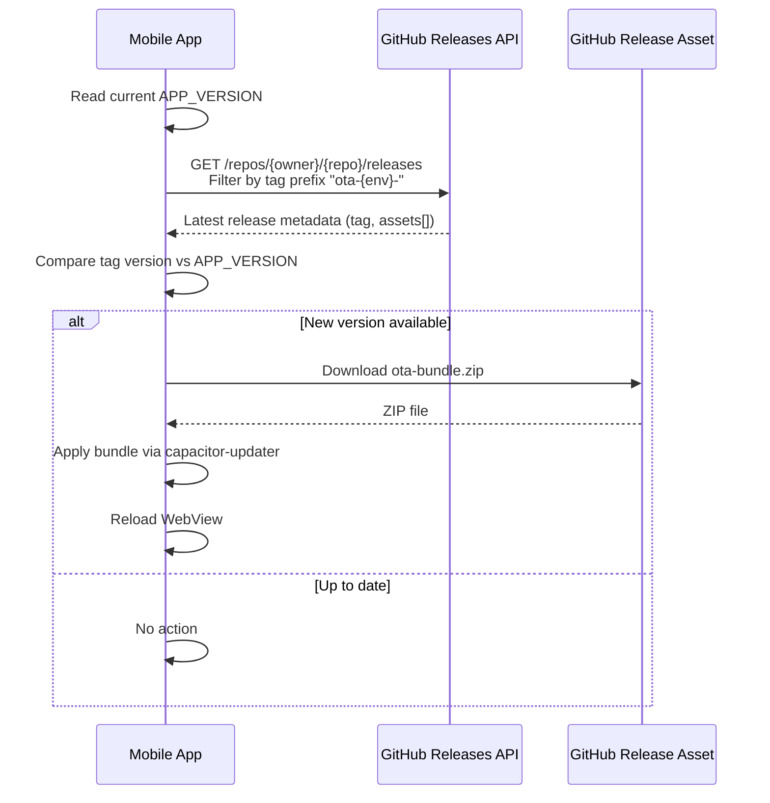

# Phase 3 — Self-Hosted OTA Updates (GitHub Releases)

## Context Block

### What You Are Building
You are implementing a **self-hosted Over-The-Air (OTA) update** system that allows the app to download and apply web bundle updates without reinstalling the APK. Updates are distributed as ZIP files attached to **GitHub Releases**, and the app checks for them on launch.

### How OTA Works — Conceptual Flow


### What You MUST Read First
1. `.agent/skills/hybrid-mobile-deployment/SKILL.md` — Platform guard rules, OTA versioning
2. `.agent/skills/runtime-stability-and-coding-health/SKILL.md` — try/catch on every async function
3. `.agent/skills/development-best-practices/SKILL.md` — Import verification

### Key Architecture Facts
- **GitHub Repo**: `villy-svg/PowerProject__20260303`
- **Release Tag Convention**: `ota-staging-v{version}` or `ota-production-v{version}`
- **ZIP Asset Name**: `ota-bundle.zip` (contains the `dist/` contents)
- **Capacitor config**: `capacitor.config.ts` at project root (from Phase 2)
- **Platform guard**: `Capacitor.isNativePlatform()` — OTA must be a no-op on web

---

## Prerequisites
- [ ] **Phase 2 completed** — Capacitor project scaffolded, debug APK builds successfully
- [ ] `npm run build` succeeds
- [ ] `capacitor.config.ts` exists at project root

---

## Sub-Phase 3.1 — Install OTA Plugin

### Step 1: Install @capgo/capacitor-updater

```bash
npm install @capgo/capacitor-updater
```

### Step 2: Sync the plugin with the Android project

```bash
npx cap sync android
```

### Step 3: Verify installation

- `package.json` → `dependencies` includes `@capgo/capacitor-updater`
- `npx cap sync` completes without errors

---

## Sub-Phase 3.2 — Create App Version Constants

### Step 1: Create the version constants file

**File**: `src/constants/appVersion.js`

```javascript
/**
 * App Version Constants
 * 
 * APP_VERSION must be incremented for every release.
 * It is compared against GitHub Release tags to detect OTA updates.
 * 
 * Tag convention: ota-{env}-v{APP_VERSION}
 * Example: ota-staging-v1.0.0, ota-production-v1.0.0
 */

export const APP_VERSION = '1.0.0';

export const OTA_CONFIG = {
  // GitHub repository for checking releases
  owner: 'villy-svg',
  repo: 'PowerProject__20260303',
  
  // Tag prefixes for each environment
  // Staging uses the staging Supabase URL as a detection mechanism
  tagPrefix: {
    staging: 'ota-staging-v',
    production: 'ota-production-v',
  },
  
  // Asset filename to download from the release
  bundleAssetName: 'ota-bundle.zip',
  
  // Minimum interval between update checks (milliseconds)
  // Default: 1 hour — prevents excessive API calls
  checkIntervalMs: 60 * 60 * 1000,
};
```

> [!IMPORTANT]
> **Skill Compliance — Hybrid Mobile Deployment §2**:
> `APP_VERSION` MUST be bumped for every release. The CI/CD pipeline (Phase 4) uses this value to create the GitHub Release tag.

---

## Sub-Phase 3.3 — Create OTA Update Service

### Step 1: Create the service file

**File**: `src/services/core/otaUpdateService.js`

```javascript
/**
 * OTA Update Service
 * 
 * Checks GitHub Releases for new web bundle versions and applies them
 * using @capgo/capacitor-updater.
 * 
 * CRITICAL: This service MUST only run on native platforms.
 * On web (GitHub Pages), all methods are no-ops.
 * 
 * Skill compliance:
 * - Runtime Stability: Every async function has try/catch
 * - Hybrid Mobile: Platform guarded via Capacitor.isNativePlatform()
 * - Dev Best Practices: All imports verified
 */

import { Capacitor } from '@capacitor/core';
import { CapacitorUpdater } from '@capgo/capacitor-updater';
import { APP_VERSION, OTA_CONFIG } from '../../constants/appVersion';

// ── Environment Detection ──
// Determine if this build targets staging or production
// based on the Supabase URL injected at build time
const SUPABASE_URL = import.meta.env.VITE_SUPABASE_URL || '';
const IS_STAGING = SUPABASE_URL.includes('staging') || 
                   SUPABASE_URL.includes('nmdxitxelwlnbdrzzopc'); // staging project ref

/**
 * Determines the current environment tag prefix
 * @returns {'staging' | 'production'}
 */
function getCurrentEnvironment() {
  return IS_STAGING ? 'staging' : 'production';
}

/**
 * Checks GitHub Releases API for a newer version
 * @returns {Promise<{hasUpdate: boolean, version?: string, downloadUrl?: string}>}
 */
async function checkForUpdate() {
  // Platform guard — no-op on web
  if (!Capacitor.isNativePlatform()) {
    return { hasUpdate: false };
  }

  try {
    const env = getCurrentEnvironment();
    const prefix = OTA_CONFIG.tagPrefix[env];
    
    const response = await fetch(
      `https://api.github.com/repos/${OTA_CONFIG.owner}/${OTA_CONFIG.repo}/releases`,
      {
        headers: {
          'Accept': 'application/vnd.github.v3+json',
          // Public repo — no auth token needed
        },
      }
    );

    if (!response.ok) {
      console.warn(`[OTA] GitHub API returned ${response.status}`);
      return { hasUpdate: false };
    }

    const releases = await response.json();
    
    // Filter releases matching our environment prefix
    const relevantReleases = releases.filter(r => 
      r.tag_name.startsWith(prefix) && !r.draft && !r.prerelease
    );

    if (relevantReleases.length === 0) {
      console.log('[OTA] No releases found for environment:', env);
      return { hasUpdate: false };
    }

    // Get the latest release (GitHub returns them sorted by date, newest first)
    const latest = relevantReleases[0];
    const latestVersion = latest.tag_name.replace(prefix, '');
    
    // Compare versions
    if (isNewerVersion(latestVersion, APP_VERSION)) {
      // Find the bundle asset
      const bundleAsset = latest.assets.find(
        a => a.name === OTA_CONFIG.bundleAssetName
      );

      if (!bundleAsset) {
        console.warn('[OTA] Release found but no bundle asset:', latest.tag_name);
        return { hasUpdate: false };
      }

      console.log(`[OTA] Update available: ${APP_VERSION} → ${latestVersion}`);
      return {
        hasUpdate: true,
        version: latestVersion,
        downloadUrl: bundleAsset.browser_download_url,
        releaseNotes: latest.body || '',
      };
    }

    console.log('[OTA] App is up to date:', APP_VERSION);
    return { hasUpdate: false };
  } catch (error) {
    console.error('[OTA] Update check failed:', error);
    return { hasUpdate: false };
  }
}

/**
 * Downloads and applies an OTA update
 * @param {string} downloadUrl - Direct download URL for the bundle ZIP
 * @param {string} version - Version string for logging
 * @returns {Promise<boolean>} - true if update was applied
 */
async function applyUpdate(downloadUrl, version) {
  // Platform guard
  if (!Capacitor.isNativePlatform()) {
    return false;
  }

  try {
    console.log(`[OTA] Downloading bundle v${version}...`);
    
    // Download the bundle — capacitor-updater handles ZIP extraction
    const bundle = await CapacitorUpdater.download({
      url: downloadUrl,
      version: version,
    });

    console.log(`[OTA] Bundle downloaded. Applying...`);
    
    // Set the new bundle as active — it will load on next app launch
    await CapacitorUpdater.set(bundle);

    console.log(`[OTA] Update applied. Will take effect on next launch.`);
    return true;
  } catch (error) {
    console.error('[OTA] Update application failed:', error);
    return false;
  }
}

/**
 * Notifies the plugin that the current bundle is working correctly.
 * MUST be called after app successfully loads with a new bundle.
 * If not called, the plugin will roll back to the previous bundle on next launch.
 */
async function notifyAppReady() {
  if (!Capacitor.isNativePlatform()) return;
  
  try {
    await CapacitorUpdater.notifyAppReady();
    console.log('[OTA] App ready notification sent to updater.');
  } catch (error) {
    console.error('[OTA] notifyAppReady failed:', error);
  }
}

/**
 * Simple semantic version comparison
 * Returns true if versionA is newer than versionB
 * @param {string} versionA - e.g., "1.2.3"
 * @param {string} versionB - e.g., "1.2.0"
 * @returns {boolean}
 */
function isNewerVersion(versionA, versionB) {
  try {
    const partsA = versionA.split('.').map(Number);
    const partsB = versionB.split('.').map(Number);
    
    for (let i = 0; i < 3; i++) {
      const a = partsA[i] || 0;
      const b = partsB[i] || 0;
      if (a > b) return true;
      if (a < b) return false;
    }
    return false; // Equal versions
  } catch (error) {
    console.error('[OTA] Version comparison failed:', error);
    return false;
  }
}

/**
 * Convenience: Check + Apply in one call
 * Returns update info for UI display
 */
async function checkAndApply() {
  if (!Capacitor.isNativePlatform()) {
    return { updated: false };
  }

  try {
    const result = await checkForUpdate();
    
    if (result.hasUpdate) {
      const applied = await applyUpdate(result.downloadUrl, result.version);
      return {
        updated: applied,
        version: result.version,
        releaseNotes: result.releaseNotes,
      };
    }
    
    return { updated: false };
  } catch (error) {
    console.error('[OTA] checkAndApply failed:', error);
    return { updated: false };
  }
}

export const otaUpdateService = {
  checkForUpdate,
  applyUpdate,
  notifyAppReady,
  checkAndApply,
  getCurrentEnvironment,
  isNewerVersion,
};
```

---

## Sub-Phase 3.4 — Create useOTAUpdate Hook

### Step 1: Create the hook

**File**: `src/hooks/useOTAUpdate.js`

```javascript
/**
 * useOTAUpdate Hook
 * 
 * Manages OTA update lifecycle:
 * 1. On mount, notify plugin that current bundle is healthy
 * 2. Check for updates once (respecting interval throttle)
 * 3. Expose update state for optional UI display
 * 
 * CRITICAL: All operations are no-ops on web platform.
 * 
 * Skill compliance:
 * - Runtime Stability: try/catch on all async operations
 * - Dev Best Practices: Isolated logic in hook, not in component
 */

import { useState, useEffect, useCallback } from 'react';
import { Capacitor } from '@capacitor/core';
import { otaUpdateService } from '../services/core/otaUpdateService';
import { OTA_CONFIG } from '../constants/appVersion';

const LAST_CHECK_KEY = 'ota_last_check_timestamp';

export function useOTAUpdate() {
  const [updateAvailable, setUpdateAvailable] = useState(false);
  const [updateVersion, setUpdateVersion] = useState(null);
  const [isChecking, setIsChecking] = useState(false);
  const [isApplying, setIsApplying] = useState(false);

  // Notify plugin on mount that the current bundle is working
  useEffect(() => {
    if (!Capacitor.isNativePlatform()) return;

    const init = async () => {
      try {
        await otaUpdateService.notifyAppReady();
      } catch (error) {
        console.error('[useOTAUpdate] notifyAppReady failed:', error);
      }
    };

    init();
  }, []);

  // Check for updates (throttled)
  const checkForUpdate = useCallback(async () => {
    if (!Capacitor.isNativePlatform()) return;

    // Throttle: Don't check more often than the configured interval
    try {
      const lastCheck = localStorage.getItem(LAST_CHECK_KEY);
      if (lastCheck) {
        const elapsed = Date.now() - parseInt(lastCheck, 10);
        if (elapsed < OTA_CONFIG.checkIntervalMs) {
          console.log('[useOTAUpdate] Skipping check — within throttle interval');
          return;
        }
      }
    } catch (e) {
      // localStorage may not be available — proceed with check
    }

    setIsChecking(true);
    try {
      const result = await otaUpdateService.checkForUpdate();
      
      if (result.hasUpdate) {
        setUpdateAvailable(true);
        setUpdateVersion(result.version);
        // Auto-apply in background
        setIsApplying(true);
        await otaUpdateService.applyUpdate(result.downloadUrl, result.version);
        setIsApplying(false);
      }

      // Record successful check timestamp
      try {
        localStorage.setItem(LAST_CHECK_KEY, Date.now().toString());
      } catch (e) {
        // Ignore localStorage errors
      }
    } catch (error) {
      console.error('[useOTAUpdate] Check failed:', error);
    } finally {
      setIsChecking(false);
    }
  }, []);

  // Auto-check on mount
  useEffect(() => {
    if (!Capacitor.isNativePlatform()) return;
    
    // Delay the check slightly to not block app startup
    const timer = setTimeout(checkForUpdate, 3000);
    return () => clearTimeout(timer);
  }, [checkForUpdate]);

  return {
    updateAvailable,
    updateVersion,
    isChecking,
    isApplying,
    checkForUpdate,
  };
}
```

---

## Sub-Phase 3.5 — Integrate into App.jsx

### Step 1: Add the hook import to App.jsx

**File**: `src/App.jsx`

Add this import at the top of the file, in the `// Hooks` section (around line 16-18):

```javascript
import { useOTAUpdate } from './hooks/useOTAUpdate';
```

### Step 2: Call the hook inside the App function

Inside the `function App() {` body, after the existing hooks (around line 57-62), add:

```javascript
  // OTA Update Hook — no-op on web, checks for updates on native
  const { updateAvailable, updateVersion } = useOTAUpdate();
```

> [!CAUTION]
> **Do NOT conditionally call this hook.** React hooks must always be called in the same order. The hook itself handles the platform guard internally via `Capacitor.isNativePlatform()`. Wrapping it in an `if` would violate the Rules of Hooks and cause crashes.

### Step 3: Update Capacitor config for manual OTA control

**File**: `capacitor.config.ts`

Update the `plugins` section to add the CapacitorUpdater config:

```typescript
  plugins: {
    SplashScreen: {
      launchAutoHide: true,
      backgroundColor: '#050505',
      androidScaleType: 'CENTER_CROP',
      showSpinner: false,
      splashFullScreen: true,
      splashImmersive: true,
    },
    CapacitorUpdater: {
      // We manage updates manually via otaUpdateService
      autoUpdate: false,
    },
  },
```

### Step 4: Sync the changes

```bash
npm run build
npx cap sync android
```

---

## Checkpoint — Phase 3 Complete

### Web Regression Check (CRITICAL)
```bash
npm run dev
```
- [ ] **PASS**: Web dev server starts without errors
- [ ] **PASS**: Browser console shows NO errors related to `@capacitor/core` or `@capgo/capacitor-updater`
- [ ] **PASS**: The `useOTAUpdate` hook does NOT trigger any API calls on web (check Network tab — no requests to `api.github.com`)
- [ ] **PASS**: App loads normally, auth works, data displays correctly

### Build Verification
```bash
npm run build
```
- [ ] **PASS**: Production build succeeds
- [ ] **PASS**: No warnings about missing imports or undefined variables

### File Verification
- [ ] **PASS**: `src/constants/appVersion.js` exists with `APP_VERSION = '1.0.0'`
- [ ] **PASS**: `src/services/core/otaUpdateService.js` exists
- [ ] **PASS**: `src/hooks/useOTAUpdate.js` exists
- [ ] **PASS**: `App.jsx` imports and calls `useOTAUpdate`
- [ ] **PASS**: `capacitor.config.ts` has `CapacitorUpdater: { autoUpdate: false }`

### Code Quality Check
- [ ] **PASS**: Every `async` function in `otaUpdateService.js` has a `try/catch` block
- [ ] **PASS**: Every function that accesses native APIs is guarded by `Capacitor.isNativePlatform()`
- [ ] **PASS**: No hardcoded hex colors in any JS/JSX files
- [ ] **PASS**: All imports in `App.jsx` are verified (no new unused imports)

---

## Rollback Plan

1. **Remove hook call from App.jsx**: Delete the `useOTAUpdate` import and hook call
2. **Delete created files**:
   - `src/constants/appVersion.js`
   - `src/services/core/otaUpdateService.js`
   - `src/hooks/useOTAUpdate.js`
3. **Revert `capacitor.config.ts`**: Remove the `CapacitorUpdater` plugin config
4. **Uninstall plugin**: `npm uninstall @capgo/capacitor-updater`
5. **Sync**: `npx cap sync android`
6. **Verify**: `npm run build && npm run dev` — web app works, no console errors

---

## Files Modified Summary

| Action | File | Description |
|--------|------|-------------|
| **MODIFIED** | `package.json` | Added `@capgo/capacitor-updater` dependency |
| **NEW** | `src/constants/appVersion.js` | APP_VERSION and OTA_CONFIG constants |
| **NEW** | `src/services/core/otaUpdateService.js` | OTA update check + apply logic |
| **NEW** | `src/hooks/useOTAUpdate.js` | React hook for OTA lifecycle |
| **MODIFIED** | `src/App.jsx` | Added useOTAUpdate hook import and call |
| **MODIFIED** | `capacitor.config.ts` | Added CapacitorUpdater manual mode config |
