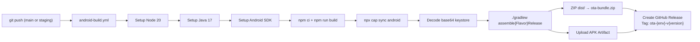

# Phase 4 — GitHub Actions CI/CD Pipeline

## Context Block

### What You Are Building
You are creating a **GitHub Actions workflow** that automatically builds signed Android APKs and publishes OTA update bundles as GitHub Releases whenever code is pushed to `main` (production) or `staging`.

### Pipeline Architecture


### What You MUST Read First
1. `.agent/skills/hybrid-mobile-deployment/SKILL.md` — CI/CD patterns, tag conventions
2. `.agent/skills/runtime-stability-and-coding-health/SKILL.md` — Zero-crash policy

### Key Architecture Facts
- **Existing workflows**: 7 workflows in `.github/workflows/` (gh-pages, staging-frontend, archival, etc.)
- **Existing CI patterns**: Node 18 + `npm ci` + env-specific secrets (see `gh-pages.yml` and `staging-frontend.yml`)
- **Repo**: `villy-svg/PowerProject__20260303`
- **Production secrets**: `VITE_SUPABASE_URL`, `VITE_SUPABASE_ANON_KEY`
- **Staging secrets**: `SUPABASE_STAGING_URL`, `SUPABASE_STAGING_ANON_KEY`
- **New secrets needed**: `ANDROID_KEYSTORE_BASE64`, `ANDROID_KEYSTORE_PASSWORD`, `ANDROID_KEY_ALIAS`, `ANDROID_KEY_PASSWORD`
- **APK flavors**: `staging` (suffix `.staging`) and `production` (base `in.powerproject.app`)

---

## Prerequisites
- [ ] **Phase 3 completed** — OTA service exists, `APP_VERSION` in `src/constants/appVersion.js`
- [ ] **Phase 2 completed** — `android/` project scaffolded, Gradle flavors configured
- [ ] GitHub repo access with permissions to add secrets and create releases
- [ ] Java JDK 17 installed locally (for keystore generation)

---

## Sub-Phase 4.1 — One-Time Keystore Generation

> [!IMPORTANT]
> This is a **one-time manual step** performed by the developer on their local machine. The keystore is NEVER committed to the repository.

### Step 1: Generate a Java keystore

Run this command in any terminal:

```bash
keytool -genkey -v -keystore powerproject-release.jks -keyalg RSA -keysize 2048 -validity 10000 -alias powerproject
```

You will be prompted:
- **Keystore password**: Choose a strong password (e.g., `PPr3l34s3!Key2026`)
- **Key password**: Can be the same as keystore password
- **Your name / organization**: `PowerPod` / `PowerPod Technologies`
- **Country code**: `IN`

### Step 2: Base64-encode the keystore

**Linux/Mac:**
```bash
base64 -i powerproject-release.jks | tr -d '\n' > keystore-base64.txt
```

**Windows (PowerShell):**
```powershell
[Convert]::ToBase64String([IO.File]::ReadAllBytes("powerproject-release.jks")) | Out-File -Encoding ASCII keystore-base64.txt
```

### Step 3: Record the values

You now have 4 values to store as GitHub Secrets:

| Secret Name | Value |
|-------------|-------|
| `ANDROID_KEYSTORE_BASE64` | Contents of `keystore-base64.txt` |
| `ANDROID_KEYSTORE_PASSWORD` | The keystore password you chose |
| `ANDROID_KEY_ALIAS` | `powerproject` |
| `ANDROID_KEY_PASSWORD` | The key password you chose |

> [!CAUTION]
> **Delete `powerproject-release.jks` and `keystore-base64.txt` from your local machine after storing them as secrets.** They should only exist in GitHub Secrets. If the keystore is lost, you cannot sign updates for existing installs — you'd need to redistribute from scratch.

---

## Sub-Phase 4.2 — Configure GitHub Secrets

### Step 1: Navigate to repo settings

Go to: `https://github.com/villy-svg/PowerProject__20260303/settings/secrets/actions`

### Step 2: Add the following repository secrets

| Secret Name | Description |
|-------------|-------------|
| `ANDROID_KEYSTORE_BASE64` | Base64-encoded `.jks` keystore file |
| `ANDROID_KEYSTORE_PASSWORD` | Keystore password |
| `ANDROID_KEY_ALIAS` | Key alias (default: `powerproject`) |
| `ANDROID_KEY_PASSWORD` | Key password |

### Step 3: Verify existing secrets

Confirm these secrets already exist (from existing web deployment workflows):

| Secret Name | Purpose | Used By |
|-------------|---------|---------|
| `VITE_SUPABASE_URL` | Production Supabase URL | gh-pages.yml, android-build.yml |
| `VITE_SUPABASE_ANON_KEY` | Production Supabase anon key | gh-pages.yml, android-build.yml |
| `SUPABASE_STAGING_URL` | Staging Supabase URL | staging-frontend.yml, android-build.yml |
| `SUPABASE_STAGING_ANON_KEY` | Staging Supabase anon key | staging-frontend.yml, android-build.yml |

---

## Sub-Phase 4.3 — Create the Android Build Workflow

### Step 1: Create the workflow file

**File**: `.github/workflows/android-build.yml`

```yaml
name: Android Build & OTA Release

on:
  push:
    branches:
      - main
      - staging
    paths:
      - 'src/**'
      - 'public/**'
      - 'package.json'
      - 'vite.config.*'
      - 'capacitor.config.*'
      - 'android/**'
      - '.github/workflows/android-build.yml'
  workflow_dispatch:
    inputs:
      force_env:
        description: 'Override environment (staging/production)'
        required: false
        default: ''

concurrency:
  group: "android-${{ github.ref_name }}"
  cancel-in-progress: true

permissions:
  contents: write  # Required for creating GitHub Releases

jobs:
  build-android:
    runs-on: ubuntu-latest
    
    steps:
      # ── 1. Determine Environment ──
      - name: Determine Environment
        id: env
        run: |
          if [ "${{ github.event.inputs.force_env }}" != "" ]; then
            ENV="${{ github.event.inputs.force_env }}"
          elif [ "${{ github.ref_name }}" = "main" ]; then
            ENV="production"
          else
            ENV="staging"
          fi
          echo "environment=$ENV" >> $GITHUB_OUTPUT
          echo "🎯 Building for: $ENV"

      # ── 2. Checkout ──
      - name: Checkout 🛎️
        uses: actions/checkout@v4

      # ── 3. Read App Version ──
      - name: Read APP_VERSION
        id: version
        run: |
          VERSION=$(node -e "const m = require('fs').readFileSync('src/constants/appVersion.js','utf8').match(/APP_VERSION\s*=\s*'([^']+)'/); console.log(m?.[1] || '0.0.0')")
          echo "app_version=$VERSION" >> $GITHUB_OUTPUT
          echo "📦 App Version: $VERSION"

      # ── 4. Setup Node.js ──
      - name: Setup Node.js
        uses: actions/setup-node@v4
        with:
          node-version: '20'
          cache: 'npm'

      # ── 5. Setup Java ──
      - name: Setup Java 17
        uses: actions/setup-java@v4
        with:
          distribution: 'temurin'
          java-version: '17'

      # ── 6. Setup Android SDK ──
      - name: Setup Android SDK
        uses: android-actions/setup-android@v3

      # ── 7. Install Dependencies ──
      - name: Install Dependencies
        run: npm ci

      # ── 8. Build Web Assets (Environment-Specific) ──
      - name: Build Web Assets
        run: npm run build
        env:
          VITE_SUPABASE_URL: ${{ steps.env.outputs.environment == 'production' && secrets.VITE_SUPABASE_URL || secrets.SUPABASE_STAGING_URL }}
          VITE_SUPABASE_ANON_KEY: ${{ steps.env.outputs.environment == 'production' && secrets.VITE_SUPABASE_ANON_KEY || secrets.SUPABASE_STAGING_ANON_KEY }}
          VITE_BASE_URL: /

      # ── 9. Sync Capacitor ──
      - name: Sync Capacitor
        run: npx cap sync android

      # ── 10. Decode Keystore ──
      - name: Decode Keystore
        run: |
          echo "${{ secrets.ANDROID_KEYSTORE_BASE64 }}" | base64 -d > android/app/powerproject-release.jks
          echo "✅ Keystore decoded"

      # ── 11. Build APK ──
      - name: Build Signed APK
        working-directory: android
        run: |
          FLAVOR="${{ steps.env.outputs.environment == 'production' && 'Production' || 'Staging' }}"
          echo "🔨 Building: assemble${FLAVOR}Release"
          ./gradlew assemble${FLAVOR}Release --no-daemon
        env:
          ANDROID_KEYSTORE_PATH: ${{ github.workspace }}/android/app/powerproject-release.jks
          ANDROID_KEYSTORE_PASSWORD: ${{ secrets.ANDROID_KEYSTORE_PASSWORD }}
          ANDROID_KEY_ALIAS: ${{ secrets.ANDROID_KEY_ALIAS }}
          ANDROID_KEY_PASSWORD: ${{ secrets.ANDROID_KEY_PASSWORD }}

      # ── 12. Locate APK ──
      - name: Locate Built APK
        id: apk
        run: |
          FLAVOR_LOWER="${{ steps.env.outputs.environment == 'production' && 'production' || 'staging' }}"
          APK_PATH=$(find android/app/build/outputs/apk/${FLAVOR_LOWER}/release -name "*.apk" | head -1)
          echo "apk_path=$APK_PATH" >> $GITHUB_OUTPUT
          echo "📱 APK: $APK_PATH ($(du -h $APK_PATH | cut -f1))"

      # ── 13. Upload APK as Build Artifact ──
      - name: Upload APK Artifact
        uses: actions/upload-artifact@v4
        with:
          name: PowerProject-${{ steps.env.outputs.environment }}-v${{ steps.version.outputs.app_version }}
          path: ${{ steps.apk.outputs.apk_path }}
          retention-days: 30

      # ── 14. Create OTA Bundle ──
      - name: Create OTA Bundle
        run: |
          cd dist
          zip -r ../ota-bundle.zip .
          cd ..
          echo "📦 OTA Bundle: $(du -h ota-bundle.zip | cut -f1)"

      # ── 15. Create GitHub Release ──
      - name: Create GitHub Release
        uses: softprops/action-gh-release@v2
        with:
          tag_name: ota-${{ steps.env.outputs.environment }}-v${{ steps.version.outputs.app_version }}
          name: "${{ steps.env.outputs.environment == 'production' && 'Production' || 'Staging' }} v${{ steps.version.outputs.app_version }}"
          body: |
            ## ${{ steps.env.outputs.environment == 'production' && '🚀 Production' || '🧪 Staging' }} Release v${{ steps.version.outputs.app_version }}
            
            **Branch**: `${{ github.ref_name }}`
            **Commit**: `${{ github.sha }}`
            **Built**: ${{ github.event.head_commit.timestamp }}
            
            ### Assets
            - 📱 **APK**: Install directly on Android device
            - 📦 **OTA Bundle**: Auto-downloaded by existing installs
            
            ### Changes
            ${{ github.event.head_commit.message }}
          files: |
            ${{ steps.apk.outputs.apk_path }}
            ota-bundle.zip
          draft: false
          prerelease: ${{ steps.env.outputs.environment == 'staging' }}
          make_latest: ${{ steps.env.outputs.environment == 'production' }}

      # ── 16. Cleanup ──
      - name: Cleanup Keystore
        if: always()
        run: rm -f android/app/powerproject-release.jks
```

---

## Sub-Phase 4.4 — Verify Workflow Syntax

### Step 1: Validate YAML syntax locally

```bash
# Install yamllint if not available
# pip install yamllint

yamllint .github/workflows/android-build.yml
```

Or use an online YAML validator to check for syntax errors.

### Step 2: Review the workflow against existing patterns

Compare with `.github/workflows/gh-pages.yml` to verify:
- Same `actions/checkout@v4` version
- Same `actions/setup-node@v4` with cache
- Environment secrets use the same names as existing workflows
- Permissions block mirrors existing workflows

### Step 3: Commit and push a test (optional)

If you want to test the workflow without affecting production:
1. Create a feature branch: `git checkout -b test/android-build`
2. Temporarily add the branch to the `on.push.branches` list
3. Push → watch the Action run
4. Remove the test branch from triggers

---

## Checkpoint — Phase 4 Complete

### Workflow File Verification
- [ ] **PASS**: `.github/workflows/android-build.yml` exists
- [ ] **PASS**: YAML is valid (no syntax errors)
- [ ] **PASS**: Triggers on push to `main` and `staging`
- [ ] **PASS**: Uses Node 20 (not 18 — upgrade from existing workflows)
- [ ] **PASS**: Uses Java 17 (Temurin distribution)
- [ ] **PASS**: Reads `APP_VERSION` from `src/constants/appVersion.js`
- [ ] **PASS**: Environment detection correctly maps `main` → production, `staging` → staging
- [ ] **PASS**: Supabase secrets correctly switch between environments
- [ ] **PASS**: Keystore is decoded from base64, used for signing, then deleted in cleanup
- [ ] **PASS**: GitHub Release uses tag `ota-{env}-v{version}` format
- [ ] **PASS**: OTA bundle is a ZIP of `dist/` contents
- [ ] **PASS**: Staging releases are marked as `prerelease: true`

### Secrets Checklist
- [ ] **PASS**: `ANDROID_KEYSTORE_BASE64` is set in GitHub Secrets
- [ ] **PASS**: `ANDROID_KEYSTORE_PASSWORD` is set
- [ ] **PASS**: `ANDROID_KEY_ALIAS` is set (value: `powerproject`)
- [ ] **PASS**: `ANDROID_KEY_PASSWORD` is set
- [ ] **PASS**: Existing Supabase secrets still configured (not accidentally removed)

### Web Regression Check
- [ ] **PASS**: `.github/workflows/gh-pages.yml` is UNCHANGED
- [ ] **PASS**: `.github/workflows/staging-frontend.yml` is UNCHANGED
- [ ] **PASS**: No changes to any other existing workflow files

### Integration Check (requires running the workflow)
- [ ] **PASS**: Push to `staging` triggers the workflow
- [ ] **PASS**: Workflow completes successfully (green ✅)
- [ ] **PASS**: GitHub Release is created with tag `ota-staging-v1.0.0`
- [ ] **PASS**: Release contains APK file and `ota-bundle.zip`
- [ ] **PASS**: APK can be downloaded and installed on a device

---

## Rollback Plan

1. **Delete the workflow file**: Remove `.github/workflows/android-build.yml`
2. **Remove GitHub Secrets** (optional — they're harmless if unused):
   - `ANDROID_KEYSTORE_BASE64`
   - `ANDROID_KEYSTORE_PASSWORD`
   - `ANDROID_KEY_ALIAS`
   - `ANDROID_KEY_PASSWORD`
3. **Delete any created GitHub Releases** manually from the repo's Releases page
4. **Verify**: Push to `main` → only `gh-pages.yml` triggers (not android-build)

---

## Files Modified Summary

| Action | File | Description |
|--------|------|-------------|
| **NEW** | `.github/workflows/android-build.yml` | CI/CD workflow for Android APK builds + OTA releases |
| **None** | `package.json` | No changes in this phase |
| **None** | All existing workflows | Zero modifications — web deploy unchanged |
