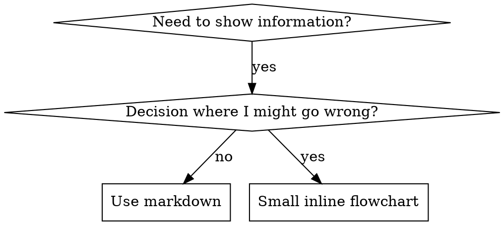

# Skill Creator

A skill for creating new skills and iteratively improving them.

At a high level, the process of creating a skill goes like this:

- Decide what you want the skill to do and roughly how it should do it
- Write a draft of the skill
- Create a few test prompts and run claude-with-access-to-the-skill on them
- Help the user evaluate the results both qualitatively and quantitatively
  - While the runs happen in the background, draft some quantitative evals if there aren't any (if there are some, you can either use as is or modify if you feel something needs to change about them). Then explain them to the user (or if they already existed, explain the ones that already exist)
  - Use the `eval-viewer/generate_review.py` script to show the user the results for them to look at, and also let them look at the quantitative metrics
- Rewrite the skill based on feedback from the user's evaluation of the results (and also if there are any glaring flaws that become apparent from the quantitative benchmarks)
- Repeat until you're satisfied
- Expand the test set and try again at larger scale

Your job when using this skill is to figure out where the user is in this process and then jump in and help them progress through these stages. So for instance, maybe they're like "I want to make a skill for X". You can help narrow down what they mean, write a draft, write the test cases, figure out how they want to evaluate, run all the prompts, and repeat.

On the other hand, maybe they already have a draft of the skill. In this case you can go straight to the eval/iterate part of the loop.

Of course, you should always be flexible and if the user is like "I don't need to run a bunch of evaluations, just vibe with me", you can do that instead.

Then after the skill is done (but again, the order is flexible), you can also run the skill description improver, which we have a whole separate script for, to optimize the triggering of the skill.

Cool? Cool.

## Communicating with the user

The skill creator is liable to be used by people across a wide range of familiarity with coding jargon. If you haven't heard (and how could you, it's only very recently that it started), there's a trend now where the power of Claude is inspiring plumbers to open up their terminals, parents and grandparents to google "how to install npm". On the other hand, the bulk of users are probably fairly computer-literate.

So please pay attention to context cues to understand how to phrase your communication! In the default case, just to give you some idea:

- "evaluation" and "benchmark" are borderline, but OK
- for "JSON" and "assertion" you want to see serious cues from the user that they know what those things are before using them without explaining them

It's OK to briefly explain terms if you're in doubt, and feel free to clarify terms with a short definition if you're unsure if the user will get it.

---

## Creating a skill

### Capture Intent

Start by understanding the user's intent. The current conversation might already contain a workflow the user wants to capture (e.g., they say "turn this into a skill"). If so, extract answers from the conversation history first — the tools used, the sequence of steps, corrections the user made, input/output formats observed. The user may need to fill the gaps, and should confirm before proceeding to the next step.

1. What should this skill enable Claude to do?
2. When should this skill trigger? (what user phrases/contexts)
3. What's the expected output format?
4. Should we set up test cases to verify the skill works? Skills with objectively verifiable outputs (file transforms, data extraction, code generation, fixed workflow steps) benefit from test cases. Skills with subjective outputs (writing style, art) often don't need them. Suggest the appropriate default based on the skill type, but let the user decide.

### Interview and Research

Proactively ask questions about edge cases, input/output formats, example files, success criteria, and dependencies. Wait to write test prompts until you've got this part ironed out.

Check available MCPs - if useful for research (searching docs, finding similar skills, looking up best practices), research in parallel via subagents if available, otherwise inline. Come prepared with context to reduce burden on the user.

### Write the SKILL.md

Based on the user interview, fill in these components:

- **name**: Skill identifier
- **description**: When to trigger, what it does. This is the primary triggering mechanism - include both what the skill does AND specific contexts for when to use it. All "when to use" info goes here, not in the body. Note: currently Claude has a tendency to "undertrigger" skills -- to not use them when they'd be useful. To combat this, please make the skill descriptions a little bit "pushy". So for instance, instead of "How to build a simple fast dashboard to display internal Anthropic data.", you might write "How to build a simple fast dashboard to display internal Anthropic data. Make sure to use this skill whenever the user mentions dashboards, data visualization, internal metrics, or wants to display any kind of company data, even if they don't explicitly ask for a 'dashboard.'"
- **compatibility**: Required tools, dependencies (optional, rarely needed)
- **the rest of the skill :)**

### Skill Writing Guide

#### Anatomy of a Skill

```
skill-name/
├── SKILL.md (required)
│   ├── YAML frontmatter (name, description required)
│   └── Markdown instructions
└── Bundled Resources (optional)
    ├── scripts/    - Executable code for deterministic/repetitive tasks
    ├── references/ - Docs loaded into context as needed
    └── assets/     - Files used in output (templates, icons, fonts)
```

#### Progressive Disclosure

Skills use a three-level loading system:
1. **Metadata** (name + description) - Always in context (~100 words)
2. **SKILL.md body** - In context whenever skill triggers (<500 lines ideal)
3. **Bundled resources** - As needed (unlimited, scripts can execute without loading)

These word counts are approximate and you can feel free to go longer if needed.

**Key patterns:**
- Keep SKILL.md under 500 lines; if you're approaching this limit, add an additional layer of hierarchy along with clear pointers about where the model using the skill should go next to follow up.
- Reference files clearly from SKILL.md with guidance on when to read them
- For large reference files (>300 lines), include a table of contents

**Domain organization**: When a skill supports multiple domains/frameworks, organize by variant:
```
cloud-deploy/
├── SKILL.md (workflow + selection)
└── references/
    ├── aws.md
    ├── gcp.md
    └── azure.md
```
Claude reads only the relevant reference file.

#### Principle of Lack of Surprise

This goes without saying, but skills must not contain malware, exploit code, or any content that could compromise system security. A skill's contents should not surprise the user in their intent if described. Don't go along with requests to create misleading skills or skills designed to facilitate unauthorized access, data exfiltration, or other malicious activities. Things like a "roleplay as an XYZ" are OK though.

#### Writing Patterns

Prefer using the imperative form in instructions.

**Defining output formats** - You can do it like this:
```markdown
## Report structure
ALWAYS use this exact template:
# [Title]
## Executive summary
## Key findings
## Recommendations
```

**Examples pattern** - It's useful to include examples. You can format them like this (but if "Input" and "Output" are in the examples you might want to deviate a little):
```markdown
## Commit message format
**Example 1:**
Input: Added user authentication with JWT tokens
Output: feat(auth): implement JWT-based authentication
```

### Writing Style

Try to explain to the model why things are important in lieu of heavy-handed musty MUSTs. Use theory of mind and try to make the skill general and not super-narrow to specific examples. Start by writing a draft and then look at it with fresh eyes and improve it.

### Test Cases

After writing the skill draft, come up with 2-3 realistic test prompts — the kind of thing a real user would actually say. Share them with the user: [you don't have to use this exact language] "Here are a few test cases I'd like to try. Do these look right, or do you want to add more?" Then run them.

Save test cases to `evals/evals.json`. Don't write assertions yet — just the prompts. You'll draft assertions in the next step while the runs are in progress.

```json
{
  "skill_name": "example-skill",
  "evals": [
    {
      "id": 1,
      "prompt": "User's task prompt",
      "expected_output": "Description of expected result",
      "files": []
    }
  ]
}
```

See `references/schemas.md` for the full schema (including the `assertions` field, which you'll add later).

## Running and evaluating test cases

This section is one continuous sequence — don't stop partway through. Do NOT use `/skill-test` or any other testing skill.

Put results in `<skill-name>-workspace/` as a sibling to the skill directory. Within the workspace, organize results by iteration (`iteration-1/`, `iteration-2/`, etc.) and within that, each test case gets a directory (`eval-0/`, `eval-1/`, etc.). Don't create all of this upfront — just create directories as you go.

### Step 1: Spawn all runs (with-skill AND baseline) in the same turn

For each test case, spawn two subagents in the same turn — one with the skill, one without. This is important: don't spawn the with-skill runs first and then come back for baselines later. Launch everything at once so it all finishes around the same time.

**With-skill run:**

```
Execute this task:
- Skill path: <path-to-skill>
- Task: <eval prompt>
- Input files: <eval files if any, or "none">
- Save outputs to: <workspace>/iteration-<N>/eval-<ID>/with_skill/outputs/
- Outputs to save: <what the user cares about — e.g., "the .docx file", "the final CSV">
```

**Baseline run** (same prompt, but the baseline depends on context):
- **Creating a new skill**: no skill at all. Same prompt, no skill path, save to `without_skill/outputs/`.
- **Improving an existing skill**: the old version. Before editing, snapshot the skill (`cp -r <skill-path> <workspace>/skill-snapshot/`), then point the baseline subagent at the snapshot. Save to `old_skill/outputs/`.

Write an `eval_metadata.json` for each test case (assertions can be empty for now). Give each eval a descriptive name based on what it's testing — not just "eval-0". Use this name for the directory too. If this iteration uses new or modified eval prompts, create these files for each new eval directory — don't assume they carry over from previous iterations.

```json
{
  "eval_id": 0,
  "eval_name": "descriptive-name-here",
  "prompt": "The user's task prompt",
  "assertions": []
}
```

### Step 2: While runs are in progress, draft assertions

Don't just wait for the runs to finish — you can use this time productively. Draft quantitative assertions for each test case and explain them to the user. If assertions already exist in `evals/evals.json`, review them and explain what they check.

Good assertions are objectively verifiable and have descriptive names — they should read clearly in the benchmark viewer so someone glancing at the results immediately understands what each one checks. Subjective skills (writing style, design quality) are better evaluated qualitatively — don't force assertions onto things that need human judgment.

Update the `eval_metadata.json` files and `evals/evals.json` with the assertions once drafted. Also explain to the user what they'll see in the viewer — both the qualitative outputs and the quantitative benchmark.

### Step 3: As runs complete, capture timing data

When each subagent task completes, you receive a notification containing `total_tokens` and `duration_ms`. Save this data immediately to `timing.json` in the run directory:

```json
{
  "total_tokens": 84852,
  "duration_ms": 23332,
  "total_duration_seconds": 23.3
}
```

This is the only opportunity to capture this data — it comes through the task notification and isn't persisted elsewhere. Process each notification as it arrives rather than trying to batch them.

### Step 4: Grade, aggregate, and launch the viewer

Once all runs are done:

1. **Grade each run** — spawn a grader subagent (or grade inline) that reads `agents/grader.md` and evaluates each assertion against the outputs. Save results to `grading.json` in each run directory. The grading.json expectations array must use the fields `text`, `passed`, and `evidence` (not `name`/`met`/`details` or other variants) — the viewer depends on these exact field names. For assertions that can be checked programmatically, write and run a script rather than eyeballing it — scripts are faster, more reliable, and can be reused across iterations.

2. **Aggregate into benchmark** — run the aggregation script from the skill-creator directory:
   ```bash
   python -m scripts.aggregate_benchmark <workspace>/iteration-N --skill-name <name>
   ```
   This produces `benchmark.json` and `benchmark.md` with pass_rate, time, and tokens for each configuration, with mean ± stddev and the delta. If generating benchmark.json manually, see `references/schemas.md` for the exact schema the viewer expects.
Put each with_skill version before its baseline counterpart.

3. **Do an analyst pass** — read the benchmark data and surface patterns the aggregate stats might hide. See `agents/analyzer.md` (the "Analyzing Benchmark Results" section) for what to look for — things like assertions that always pass regardless of skill (non-discriminating), high-variance evals (possibly flaky), and time/token tradeoffs.

4. **Launch the viewer** with both qualitative outputs and quantitative data:
   ```bash
   nohup python <skill-creator-path>/eval-viewer/generate_review.py \
     <workspace>/iteration-N \
     --skill-name "my-skill" \
     --benchmark <workspace>/iteration-N/benchmark.json \
     > /dev/null 2>&1 &
   VIEWER_PID=$!
   ```
   For iteration 2+, also pass `--previous-workspace <workspace>/iteration-<N-1>`.

   **Cowork / headless environments:** If `webbrowser.open()` is not available or the environment has no display, use `--static <output_path>` to write a standalone HTML file instead of starting a server. Feedback will be downloaded as a `feedback.json` file when the user clicks "Submit All Reviews". After download, copy `feedback.json` into the workspace directory for the next iteration to pick up.

Note: please use generate_review.py to create the viewer; there's no need to write custom HTML.

5. **Tell the user** something like: "I've opened the results in your browser. There are two tabs — 'Outputs' lets you click through each test case and leave feedback, 'Benchmark' shows the quantitative comparison. When you're done, come back here and let me know."

### What the user sees in the viewer

The "Outputs" tab shows one test case at a time:
- **Prompt**: the task that was given
- **Output**: the files the skill produced, rendered inline where possible
- **Previous Output** (iteration 2+): collapsed section showing last iteration's output
- **Formal Grades** (if grading was run): collapsed section showing assertion pass/fail
- **Feedback**: a textbox that auto-saves as they type
- **Previous Feedback** (iteration 2+): their comments from last time, shown below the textbox

The "Benchmark" tab shows the stats summary: pass rates, timing, and token usage for each configuration, with per-eval breakdowns and analyst observations.

Navigation is via prev/next buttons or arrow keys. When done, they click "Submit All Reviews" which saves all feedback to `feedback.json`.

### Step 5: Read the feedback

When the user tells you they're done, read `feedback.json`:

```json
{
  "reviews": [
    {"run_id": "eval-0-with_skill", "feedback": "the chart is missing axis labels", "timestamp": "..."},
    {"run_id": "eval-1-with_skill", "feedback": "", "timestamp": "..."},
    {"run_id": "eval-2-with_skill", "feedback": "perfect, love this", "timestamp": "..."}
  ],
  "status": "complete"
}
```

Empty feedback means the user thought it was fine. Focus your improvements on the test cases where the user had specific complaints.

Kill the viewer server when you're done with it:

```bash
kill $VIEWER_PID 2>/dev/null
```

---

## Improving the skill

This is the heart of the loop. You've run the test cases, the user has reviewed the results, and now you need to make the skill better based on their feedback.

### How to think about improvements

1. **Generalize from the feedback.** The big picture thing that's happening here is that we're trying to create skills that can be used a million times (maybe literally, maybe even more who knows) across many different prompts. Here you and the user are iterating on only a few examples over and over again because it helps move faster. The user knows these examples in and out and it's quick for them to assess new outputs. But if the skill you and the user are codeveloping works only for those examples, it's useless. Rather than put in fiddly overfitty changes, or oppressively constrictive MUSTs, if there's some stubborn issue, you might try branching out and using different metaphors, or recommending different patterns of working. It's relatively cheap to try and maybe you'll land on something great.

2. **Keep the prompt lean.** Remove things that aren't pulling their weight. Make sure to read the transcripts, not just the final outputs — if it looks like the skill is making the model waste a bunch of time doing things that are unproductive, you can try getting rid of the parts of the skill that are making it do that and seeing what happens.

3. **Explain the why.** Try hard to explain the **why** behind everything you're asking the model to do. Today's LLMs are *smart*. They have good theory of mind and when given a good harness can go beyond rote instructions and really make things happen. Even if the feedback from the user is terse or frustrated, try to actually understand the task and why the user is writing what they wrote, and what they actually wrote, and then transmit this understanding into the instructions. If you find yourself writing ALWAYS or NEVER in all caps, or using super rigid structures, that's a yellow flag — if possible, reframe and explain the reasoning so that the model understands why the thing you're asking for is important. That's a more humane, powerful, and effective approach.

4. **Look for repeated work across test cases.** Read the transcripts from the test runs and notice if the subagents all independently wrote similar helper scripts or took the same multi-step approach to something. If all 3 test cases resulted in the subagent writing a `create_docx.py` or a `build_chart.py`, that's a strong signal the skill should bundle that script. Write it once, put it in `scripts/`, and tell the skill to use it. This saves every future invocation from reinventing the wheel.

This task is pretty important (we are trying to create billions a year in economic value here!) and your thinking time is not the blocker; take your time and really mull things over. I'd suggest writing a draft revision and then looking at it anew and making improvements. Really do your best to get into the head of the user and understand what they want and need.

### The iteration loop

After improving the skill:

1. Apply your improvements to the skill
2. Rerun all test cases into a new `iteration-<N+1>/` directory, including baseline runs. If you're creating a new skill, the baseline is always `without_skill` (no skill) — that stays the same across iterations. If you're improving an existing skill, use your judgment on what makes sense as the baseline: the original version the user came in with, or the previous iteration.
3. Launch the reviewer with `--previous-workspace` pointing at the previous iteration
4. Wait for the user to review and tell you they're done
5. Read the new feedback, improve again, repeat

Keep going until:
- The user says they're happy
- The feedback is all empty (everything looks good)
- You're not making meaningful progress

---

## Advanced: Blind comparison

For situations where you want a more rigorous comparison between two versions of a skill (e.g., the user asks "is the new version actually better?"), there's a blind comparison system. Read `agents/comparator.md` and `agents/analyzer.md` for the details. The basic idea is: give two outputs to an independent agent without telling it which is which, and let it judge quality. Then analyze why the winner won.

This is optional, requires subagents, and most users won't need it. The human review loop is usually sufficient.

---

## Description Optimization

The description field in SKILL.md frontmatter is the primary mechanism that determines whether Claude invokes a skill. After creating or improving a skill, offer to optimize the description for better triggering accuracy.

### Step 1: Generate trigger eval queries

Create 20 eval queries — a mix of should-trigger and should-not-trigger. Save as JSON:

```json
[
  {"query": "the user prompt", "should_trigger": true},
  {"query": "another prompt", "should_trigger": false}
]
```

The queries must be realistic and something a Claude Code or Claude.ai user would actually type. Not abstract requests, but requests that are concrete and specific and have a good amount of detail. For instance, file paths, personal context about the user's job or situation, column names and values, company names, URLs. A little bit of backstory. Some might be in lowercase or contain abbreviations or typos or casual speech. Use a mix of different lengths, and focus on edge cases rather than making them clear-cut (the user will get a chance to sign off on them).

Bad: `"Format this data"`, `"Extract text from PDF"`, `"Create a chart"`

Good: `"ok so my boss just sent me this xlsx file (its in my downloads, called something like 'Q4 sales final FINAL v2.xlsx') and she wants me to add a column that shows the profit margin as a percentage. The revenue is in column C and costs are in column D i think"`

For the **should-trigger** queries (8-10), think about coverage. You want different phrasings of the same intent — some formal, some casual. Include cases where the user doesn't explicitly name the skill or file type but clearly needs it. Throw in some uncommon use cases and cases where this skill competes with another but should win.

For the **should-not-trigger** queries (8-10), the most valuable ones are the near-misses — queries that share keywords or concepts with the skill but actually need something different. Think adjacent domains, ambiguous phrasing where a naive keyword match would trigger but shouldn't, and cases where the query touches on something the skill does but in a context where another tool is more appropriate.

The key thing to avoid: don't make should-not-trigger queries obviously irrelevant. "Write a fibonacci function" as a negative test for a PDF skill is too easy — it doesn't test anything. The negative cases should be genuinely tricky.

### Step 2: Review with user

Present the eval set to the user for review using the HTML template:

1. Read the template from `assets/eval_review.html`
2. Replace the placeholders:
   - `__EVAL_DATA_PLACEHOLDER__` → the JSON array of eval items (no quotes around it — it's a JS variable assignment)
   - `__SKILL_NAME_PLACEHOLDER__` → the skill's name
   - `__SKILL_DESCRIPTION_PLACEHOLDER__` → the skill's current description
3. Write to a temp file (e.g., `/tmp/eval_review_<skill-name>.html`) and open it: `open /tmp/eval_review_<skill-name>.html`
4. The user can edit queries, toggle should-trigger, add/remove entries, then click "Export Eval Set"
5. The file downloads to `~/Downloads/eval_set.json` — check the Downloads folder for the most recent version in case there are multiple (e.g., `eval_set (1).json`)

This step matters — bad eval queries lead to bad descriptions.

### Step 3: Run the optimization loop

Tell the user: "This will take some time — I'll run the optimization loop in the background and check on it periodically."

Save the eval set to the workspace, then run in the background:

```bash
python -m scripts.run_loop \
  --eval-set <path-to-trigger-eval.json> \
  --skill-path <path-to-skill> \
  --model <model-id-powering-this-session> \
  --max-iterations 5 \
  --verbose
```

Use the model ID from your system prompt (the one powering the current session) so the triggering test matches what the user actually experiences.

While it runs, periodically tail the output to give the user updates on which iteration it's on and what the scores look like.

This handles the full optimization loop automatically. It splits the eval set into 60% train and 40% held-out test, evaluates the current description (running each query 3 times to get a reliable trigger rate), then calls Claude to propose improvements based on what failed. It re-evaluates each new description on both train and test, iterating up to 5 times. When it's done, it opens an HTML report in the browser showing the results per iteration and returns JSON with `best_description` — selected by test score rather than train score to avoid overfitting.

### How skill triggering works

Understanding the triggering mechanism helps design better eval queries. Skills appear in Claude's `available_skills` list with their name + description, and Claude decides whether to consult a skill based on that description. The important thing to know is that Claude only consults skills for tasks it can't easily handle on its own — simple, one-step queries like "read this PDF" may not trigger a skill even if the description matches perfectly, because Claude can handle them directly with basic tools. Complex, multi-step, or specialized queries reliably trigger skills when the description matches.

This means your eval queries should be substantive enough that Claude would actually benefit from consulting a skill. Simple queries like "read file X" are poor test cases — they won't trigger skills regardless of description quality.

### Step 4: Apply the result

Take `best_description` from the JSON output and update the skill's SKILL.md frontmatter. Show the user before/after and report the scores.

---

### Package and Present (only if `present_files` tool is available)

Check whether you have access to the `present_files` tool. If you don't, skip this step. If you do, package the skill and present the .skill file to the user:

```bash
python -m scripts.package_skill <path/to/skill-folder>
```

After packaging, direct the user to the resulting `.skill` file path so they can install it.

---

## Claude.ai-specific instructions

In Claude.ai, the core workflow is the same (draft → test → review → improve → repeat), but because Claude.ai doesn't have subagents, some mechanics change. Here's what to adapt:

**Running test cases**: No subagents means no parallel execution. For each test case, read the skill's SKILL.md, then follow its instructions to accomplish the test prompt yourself. Do them one at a time. This is less rigorous than independent subagents (you wrote the skill and you're also running it, so you have full context), but it's a useful sanity check — and the human review step compensates. Skip the baseline runs — just use the skill to complete the task as requested.

**Reviewing results**: If you can't open a browser (e.g., Claude.ai's VM has no display, or you're on a remote server), skip the browser reviewer entirely. Instead, present results directly in the conversation. For each test case, show the prompt and the output. If the output is a file the user needs to see (like a .docx or .xlsx), save it to the filesystem and tell them where it is so they can download and inspect it. Ask for feedback inline: "How does this look? Anything you'd change?"

**Benchmarking**: Skip the quantitative benchmarking — it relies on baseline comparisons which aren't meaningful without subagents. Focus on qualitative feedback from the user.

**The iteration loop**: Same as before — improve the skill, rerun the test cases, ask for feedback — just without the browser reviewer in the middle. You can still organize results into iteration directories on the filesystem if you have one.

**Description optimization**: This section requires the `claude` CLI tool (specifically `claude -p`) which is only available in Claude Code. Skip it if you're on Claude.ai.

**Blind comparison**: Requires subagents. Skip it.

**Packaging**: The `package_skill.py` script works anywhere with Python and a filesystem. On Claude.ai, you can run it and the user can download the resulting `.skill` file.

**Updating an existing skill**: The user might be asking you to update an existing skill, not create a new one. In this case:
- **Preserve the original name.** Note the skill's directory name and `name` frontmatter field -- use them unchanged. E.g., if the installed skill is `research-helper`, output `research-helper.skill` (not `research-helper-v2`).
- **Copy to a writeable location before editing.** The installed skill path may be read-only. Copy to `/tmp/skill-name/`, edit there, and package from the copy.
- **If packaging manually, stage in `/tmp/` first**, then copy to the output directory -- direct writes may fail due to permissions.

---

## Cowork-Specific Instructions

If you're in Cowork, the main things to know are:

- You have subagents, so the main workflow (spawn test cases in parallel, run baselines, grade, etc.) all works. (However, if you run into severe problems with timeouts, it's OK to run the test prompts in series rather than parallel.)
- You don't have a browser or display, so when generating the eval viewer, use `--static <output_path>` to write a standalone HTML file instead of starting a server. Then proffer a link that the user can click to open the HTML in their browser.
- For whatever reason, the Cowork setup seems to disincline Claude from generating the eval viewer after running the tests, so just to reiterate: whether you're in Cowork or in Claude Code, after running tests, you should always generate the eval viewer for the human to look at examples before revising the skill yourself and trying to make corrections, using `generate_review.py` (not writing your own boutique html code). Sorry in advance but I'm gonna go all caps here: GENERATE THE EVAL VIEWER *BEFORE* evaluating inputs yourself. You want to get them in front of the human ASAP!
- Feedback works differently: since there's no running server, the viewer's "Submit All Reviews" button will download `feedback.json` as a file. You can then read it from there (you may have to request access first).
- Packaging works — `package_skill.py` just needs Python and a filesystem.
- Description optimization (`run_loop.py` / `run_eval.py`) should work in Cowork just fine since it uses `claude -p` via subprocess, not a browser, but please save it until you've fully finished making the skill and the user agrees it's in good shape.
- **Updating an existing skill**: The user might be asking you to update an existing skill, not create a new one. Follow the update guidance in the claude.ai section above.

---

## Reference files

The agents/ directory contains instructions for specialized subagents. Read them when you need to spawn the relevant subagent.

- `agents/grader.md` — How to evaluate assertions against outputs
- `agents/comparator.md` — How to do blind A/B comparison between two outputs
- `agents/analyzer.md` — How to analyze why one version beat another

The references/ directory has additional documentation:
- `references/schemas.md` — JSON structures for evals.json, grading.json, etc.

---

Repeating one more time the core loop here for emphasis:

- Figure out what the skill is about
- Draft or edit the skill
- Run claude-with-access-to-the-skill on test prompts
- With the user, evaluate the outputs:
  - Create benchmark.json and run `eval-viewer/generate_review.py` to help the user review them
  - Run quantitative evals
- Repeat until you and the user are satisfied
- Package the final skill and return it to the user.

Please add steps to your TodoList, if you have such a thing, to make sure you don't forget. If you're in Cowork, please specifically put "Create evals JSON and run `eval-viewer/generate_review.py` so human can review test cases" in your TodoList to make sure it happens.

Good luck!

---

# Writing Skills

## Overview

**Writing skills IS Test-Driven Development applied to process documentation.**

**Personal skills live in agent-specific directories (`~/.claude/skills` for Claude Code, `~/.agents/skills/` for Codex)** 

You write test cases (pressure scenarios with subagents), watch them fail (baseline behavior), write the skill (documentation), watch tests pass (agents comply), and refactor (close loopholes).

**Core principle:** If you didn't watch an agent fail without the skill, you don't know if the skill teaches the right thing.

**REQUIRED BACKGROUND:** You MUST understand superpowers:test-driven-development before using this skill. That skill defines the fundamental RED-GREEN-REFACTOR cycle. This skill adapts TDD to documentation.

**Official guidance:** For Anthropic's official skill authoring best practices, see anthropic-best-practices.md. This document provides additional patterns and guidelines that complement the TDD-focused approach in this skill.

## What is a Skill?

A **skill** is a reference guide for proven techniques, patterns, or tools. Skills help future Claude instances find and apply effective approaches.

**Skills are:** Reusable techniques, patterns, tools, reference guides

**Skills are NOT:** Narratives about how you solved a problem once

## TDD Mapping for Skills

| TDD Concept | Skill Creation |
|-------------|----------------|
| **Test case** | Pressure scenario with subagent |
| **Production code** | Skill document (SKILL.md) |
| **Test fails (RED)** | Agent violates rule without skill (baseline) |
| **Test passes (GREEN)** | Agent complies with skill present |
| **Refactor** | Close loopholes while maintaining compliance |
| **Write test first** | Run baseline scenario BEFORE writing skill |
| **Watch it fail** | Document exact rationalizations agent uses |
| **Minimal code** | Write skill addressing those specific violations |
| **Watch it pass** | Verify agent now complies |
| **Refactor cycle** | Find new rationalizations → plug → re-verify |

The entire skill creation process follows RED-GREEN-REFACTOR.

## When to Create a Skill

**Create when:**
- Technique wasn't intuitively obvious to you
- You'd reference this again across projects
- Pattern applies broadly (not project-specific)
- Others would benefit

**Don't create for:**
- One-off solutions
- Standard practices well-documented elsewhere
- Project-specific conventions (put in CLAUDE.md)
- Mechanical constraints (if it's enforceable with regex/validation, automate it—save documentation for judgment calls)

## Skill Types

### Technique
Concrete method with steps to follow (condition-based-waiting, root-cause-tracing)

### Pattern
Way of thinking about problems (flatten-with-flags, test-invariants)

### Reference
API docs, syntax guides, tool documentation (office docs)

## Directory Structure


```
skills/
  skill-name/
    SKILL.md              # Main reference (required)
    supporting-file.*     # Only if needed
```

**Flat namespace** - all skills in one searchable namespace

**Separate files for:**
1. **Heavy reference** (100+ lines) - API docs, comprehensive syntax
2. **Reusable tools** - Scripts, utilities, templates

**Keep inline:**
- Principles and concepts
- Code patterns (< 50 lines)
- Everything else

## SKILL.md Structure

**Frontmatter (YAML):**
- Two required fields: `name` and `description` (see [agentskills.io/specification](https://agentskills.io/specification) for all supported fields)
- Max 1024 characters total
- `name`: Use letters, numbers, and hyphens only (no parentheses, special chars)
- `description`: Third-person, describes ONLY when to use (NOT what it does)
  - Start with "Use when..." to focus on triggering conditions
  - Include specific symptoms, situations, and contexts
  - **NEVER summarize the skill's process or workflow** (see CSO section for why)
  - Keep under 500 characters if possible

```markdown
---
name: Skill-Name-With-Hyphens
description: Use when [specific triggering conditions and symptoms]
---

# Skill Name

## Overview
What is this? Core principle in 1-2 sentences.

## When to Use
[Small inline flowchart IF decision non-obvious]

Bullet list with SYMPTOMS and use cases
When NOT to use

## Core Pattern (for techniques/patterns)
Before/after code comparison

## Quick Reference
Table or bullets for scanning common operations

## Implementation
Inline code for simple patterns
Link to file for heavy reference or reusable tools

## Common Mistakes
What goes wrong + fixes

## Real-World Impact (optional)
Concrete results
```


## Claude Search Optimization (CSO)

**Critical for discovery:** Future Claude needs to FIND your skill

### 1. Rich Description Field

**Purpose:** Claude reads description to decide which skills to load for a given task. Make it answer: "Should I read this skill right now?"

**Format:** Start with "Use when..." to focus on triggering conditions

**CRITICAL: Description = When to Use, NOT What the Skill Does**

The description should ONLY describe triggering conditions. Do NOT summarize the skill's process or workflow in the description.

**Why this matters:** Testing revealed that when a description summarizes the skill's workflow, Claude may follow the description instead of reading the full skill content. A description saying "code review between tasks" caused Claude to do ONE review, even though the skill's flowchart clearly showed TWO reviews (spec compliance then code quality).

When the description was changed to just "Use when executing implementation plans with independent tasks" (no workflow summary), Claude correctly read the flowchart and followed the two-stage review process.

**The trap:** Descriptions that summarize workflow create a shortcut Claude will take. The skill body becomes documentation Claude skips.

```yaml
# ❌ BAD: Summarizes workflow - Claude may follow this instead of reading skill
description: Use when executing plans - dispatches subagent per task with code review between tasks

# ❌ BAD: Too much process detail
description: Use for TDD - write test first, watch it fail, write minimal code, refactor

# ✅ GOOD: Just triggering conditions, no workflow summary
description: Use when executing implementation plans with independent tasks in the current session

# ✅ GOOD: Triggering conditions only
description: Use when implementing any feature or bugfix, before writing implementation code
```

**Content:**
- Use concrete triggers, symptoms, and situations that signal this skill applies
- Describe the *problem* (race conditions, inconsistent behavior) not *language-specific symptoms* (setTimeout, sleep)
- Keep triggers technology-agnostic unless the skill itself is technology-specific
- If skill is technology-specific, make that explicit in the trigger
- Write in third person (injected into system prompt)
- **NEVER summarize the skill's process or workflow**

```yaml
# ❌ BAD: Too abstract, vague, doesn't include when to use
description: For async testing

# ❌ BAD: First person
description: I can help you with async tests when they're flaky

# ❌ BAD: Mentions technology but skill isn't specific to it
description: Use when tests use setTimeout/sleep and are flaky

# ✅ GOOD: Starts with "Use when", describes problem, no workflow
description: Use when tests have race conditions, timing dependencies, or pass/fail inconsistently

# ✅ GOOD: Technology-specific skill with explicit trigger
description: Use when using React Router and handling authentication redirects
```

### 2. Keyword Coverage

Use words Claude would search for:
- Error messages: "Hook timed out", "ENOTEMPTY", "race condition"
- Symptoms: "flaky", "hanging", "zombie", "pollution"
- Synonyms: "timeout/hang/freeze", "cleanup/teardown/afterEach"
- Tools: Actual commands, library names, file types

### 3. Descriptive Naming

**Use active voice, verb-first:**
- ✅ `creating-skills` not `skill-creation`
- ✅ `condition-based-waiting` not `async-test-helpers`

### 4. Token Efficiency (Critical)

**Problem:** getting-started and frequently-referenced skills load into EVERY conversation. Every token counts.

**Target word counts:**
- getting-started workflows: <150 words each
- Frequently-loaded skills: <200 words total
- Other skills: <500 words (still be concise)

**Techniques:**

**Move details to tool help:**
```bash
# ❌ BAD: Document all flags in SKILL.md
search-conversations supports --text, --both, --after DATE, --before DATE, --limit N

# ✅ GOOD: Reference --help
search-conversations supports multiple modes and filters. Run --help for details.
```

**Use cross-references:**
```markdown
# ❌ BAD: Repeat workflow details
When searching, dispatch subagent with template...
[20 lines of repeated instructions]

# ✅ GOOD: Reference other skill
Always use subagents (50-100x context savings). REQUIRED: Use [other-skill-name] for workflow.
```

**Compress examples:**
```markdown
# ❌ BAD: Verbose example (42 words)
your human partner: "How did we handle authentication errors in React Router before?"
You: I'll search past conversations for React Router authentication patterns.
[Dispatch subagent with search query: "React Router authentication error handling 401"]

# ✅ GOOD: Minimal example (20 words)
Partner: "How did we handle auth errors in React Router?"
You: Searching...
[Dispatch subagent → synthesis]
```

**Eliminate redundancy:**
- Don't repeat what's in cross-referenced skills
- Don't explain what's obvious from command
- Don't include multiple examples of same pattern

**Verification:**
```bash
wc -w skills/path/SKILL.md
# getting-started workflows: aim for <150 each
# Other frequently-loaded: aim for <200 total
```

**Name by what you DO or core insight:**
- ✅ `condition-based-waiting` > `async-test-helpers`
- ✅ `using-skills` not `skill-usage`
- ✅ `flatten-with-flags` > `data-structure-refactoring`
- ✅ `root-cause-tracing` > `debugging-techniques`

**Gerunds (-ing) work well for processes:**
- `creating-skills`, `testing-skills`, `debugging-with-logs`
- Active, describes the action you're taking

### 4. Cross-Referencing Other Skills

**When writing documentation that references other skills:**

Use skill name only, with explicit requirement markers:
- ✅ Good: `**REQUIRED SUB-SKILL:** Use superpowers:test-driven-development`
- ✅ Good: `**REQUIRED BACKGROUND:** You MUST understand superpowers:systematic-debugging`
- ❌ Bad: `See skills/testing/test-driven-development` (unclear if required)
- ❌ Bad: `@skills/testing/test-driven-development/SKILL.md` (force-loads, burns context)

**Why no @ links:** `@` syntax force-loads files immediately, consuming 200k+ context before you need them.

## Flowchart Usage



**Use flowcharts ONLY for:**
- Non-obvious decision points
- Process loops where you might stop too early
- "When to use A vs B" decisions

**Never use flowcharts for:**
- Reference material → Tables, lists
- Code examples → Markdown blocks
- Linear instructions → Numbered lists
- Labels without semantic meaning (step1, helper2)

See @graphviz-conventions.dot for graphviz style rules.

**Visualizing for your human partner:** Use `render-graphs.js` in this directory to render a skill's flowcharts to SVG:
```bash
./render-graphs.js ../some-skill           # Each diagram separately
./render-graphs.js ../some-skill --combine # All diagrams in one SVG
```

## Code Examples

**One excellent example beats many mediocre ones**

Choose most relevant language:
- Testing techniques → TypeScript/JavaScript
- System debugging → Shell/Python
- Data processing → Python

**Good example:**
- Complete and runnable
- Well-commented explaining WHY
- From real scenario
- Shows pattern clearly
- Ready to adapt (not generic template)

**Don't:**
- Implement in 5+ languages
- Create fill-in-the-blank templates
- Write contrived examples

You're good at porting - one great example is enough.

## File Organization

### Self-Contained Skill
```
defense-in-depth/
  SKILL.md    # Everything inline
```
When: All content fits, no heavy reference needed

### Skill with Reusable Tool
```
condition-based-waiting/
  SKILL.md    # Overview + patterns
  example.ts  # Working helpers to adapt
```
When: Tool is reusable code, not just narrative

### Skill with Heavy Reference
```
pptx/
  SKILL.md       # Overview + workflows
  pptxgenjs.md   # 600 lines API reference
  ooxml.md       # 500 lines XML structure
  scripts/       # Executable tools
```
When: Reference material too large for inline

## The Iron Law (Same as TDD)

```
NO SKILL WITHOUT A FAILING TEST FIRST
```

This applies to NEW skills AND EDITS to existing skills.

Write skill before testing? Delete it. Start over.
Edit skill without testing? Same violation.

**No exceptions:**
- Not for "simple additions"
- Not for "just adding a section"
- Not for "documentation updates"
- Don't keep untested changes as "reference"
- Don't "adapt" while running tests
- Delete means delete

**REQUIRED BACKGROUND:** The superpowers:test-driven-development skill explains why this matters. Same principles apply to documentation.

## Testing All Skill Types

Different skill types need different test approaches:

### Discipline-Enforcing Skills (rules/requirements)

**Examples:** TDD, verification-before-completion, designing-before-coding

**Test with:**
- Academic questions: Do they understand the rules?
- Pressure scenarios: Do they comply under stress?
- Multiple pressures combined: time + sunk cost + exhaustion
- Identify rationalizations and add explicit counters

**Success criteria:** Agent follows rule under maximum pressure

### Technique Skills (how-to guides)

**Examples:** condition-based-waiting, root-cause-tracing, defensive-programming

**Test with:**
- Application scenarios: Can they apply the technique correctly?
- Variation scenarios: Do they handle edge cases?
- Missing information tests: Do instructions have gaps?

**Success criteria:** Agent successfully applies technique to new scenario

### Pattern Skills (mental models)

**Examples:** reducing-complexity, information-hiding concepts

**Test with:**
- Recognition scenarios: Do they recognize when pattern applies?
- Application scenarios: Can they use the mental model?
- Counter-examples: Do they know when NOT to apply?

**Success criteria:** Agent correctly identifies when/how to apply pattern

### Reference Skills (documentation/APIs)

**Examples:** API documentation, command references, library guides

**Test with:**
- Retrieval scenarios: Can they find the right information?
- Application scenarios: Can they use what they found correctly?
- Gap testing: Are common use cases covered?

**Success criteria:** Agent finds and correctly applies reference information

## Common Rationalizations for Skipping Testing

| Excuse | Reality |
|--------|---------|
| "Skill is obviously clear" | Clear to you ≠ clear to other agents. Test it. |
| "It's just a reference" | References can have gaps, unclear sections. Test retrieval. |
| "Testing is overkill" | Untested skills have issues. Always. 15 min testing saves hours. |
| "I'll test if problems emerge" | Problems = agents can't use skill. Test BEFORE deploying. |
| "Too tedious to test" | Testing is less tedious than debugging bad skill in production. |
| "I'm confident it's good" | Overconfidence guarantees issues. Test anyway. |
| "Academic review is enough" | Reading ≠ using. Test application scenarios. |
| "No time to test" | Deploying untested skill wastes more time fixing it later. |

**All of these mean: Test before deploying. No exceptions.**

## Bulletproofing Skills Against Rationalization

Skills that enforce discipline (like TDD) need to resist rationalization. Agents are smart and will find loopholes when under pressure.

**Psychology note:** Understanding WHY persuasion techniques work helps you apply them systematically. See persuasion-principles.md for research foundation (Cialdini, 2021; Meincke et al., 2025) on authority, commitment, scarcity, social proof, and unity principles.

### Close Every Loophole Explicitly

Don't just state the rule - forbid specific workarounds:

<Bad>
```markdown
Write code before test? Delete it.
```
</Bad>

<Good>
```markdown
Write code before test? Delete it. Start over.

**No exceptions:**
- Don't keep it as "reference"
- Don't "adapt" it while writing tests
- Don't look at it
- Delete means delete
```
</Good>

### Address "Spirit vs Letter" Arguments

Add foundational principle early:

```markdown
**Violating the letter of the rules is violating the spirit of the rules.**
```

This cuts off entire class of "I'm following the spirit" rationalizations.

### Build Rationalization Table

Capture rationalizations from baseline testing (see Testing section below). Every excuse agents make goes in the table:

```markdown
| Excuse | Reality |
|--------|---------|
| "Too simple to test" | Simple code breaks. Test takes 30 seconds. |
| "I'll test after" | Tests passing immediately prove nothing. |
| "Tests after achieve same goals" | Tests-after = "what does this do?" Tests-first = "what should this do?" |
```

### Create Red Flags List

Make it easy for agents to self-check when rationalizing:

```markdown
## Red Flags - STOP and Start Over

- Code before test
- "I already manually tested it"
- "Tests after achieve the same purpose"
- "It's about spirit not ritual"
- "This is different because..."

**All of these mean: Delete code. Start over with TDD.**
```

### Update CSO for Violation Symptoms

Add to description: symptoms of when you're ABOUT to violate the rule:

```yaml
description: use when implementing any feature or bugfix, before writing implementation code
```

## RED-GREEN-REFACTOR for Skills

Follow the TDD cycle:

### RED: Write Failing Test (Baseline)

Run pressure scenario with subagent WITHOUT the skill. Document exact behavior:
- What choices did they make?
- What rationalizations did they use (verbatim)?
- Which pressures triggered violations?

This is "watch the test fail" - you must see what agents naturally do before writing the skill.

### GREEN: Write Minimal Skill

Write skill that addresses those specific rationalizations. Don't add extra content for hypothetical cases.

Run same scenarios WITH skill. Agent should now comply.

### REFACTOR: Close Loopholes

Agent found new rationalization? Add explicit counter. Re-test until bulletproof.

**Testing methodology:** See @testing-skills-with-subagents.md for the complete testing methodology:
- How to write pressure scenarios
- Pressure types (time, sunk cost, authority, exhaustion)
- Plugging holes systematically
- Meta-testing techniques

## Anti-Patterns

### ❌ Narrative Example
"In session 2025-10-03, we found empty projectDir caused..."
**Why bad:** Too specific, not reusable

### ❌ Multi-Language Dilution
example-js.js, example-py.py, example-go.go
**Why bad:** Mediocre quality, maintenance burden

### ❌ Code in Flowcharts
```dot
step1 [label="import fs"];
step2 [label="read file"];
```
**Why bad:** Can't copy-paste, hard to read

### ❌ Generic Labels
helper1, helper2, step3, pattern4
**Why bad:** Labels should have semantic meaning

## STOP: Before Moving to Next Skill

**After writing ANY skill, you MUST STOP and complete the deployment process.**

**Do NOT:**
- Create multiple skills in batch without testing each
- Move to next skill before current one is verified
- Skip testing because "batching is more efficient"

**The deployment checklist below is MANDATORY for EACH skill.**

Deploying untested skills = deploying untested code. It's a violation of quality standards.

## Skill Creation Checklist (TDD Adapted)

**IMPORTANT: Use TodoWrite to create todos for EACH checklist item below.**

**RED Phase - Write Failing Test:**
- [ ] Create pressure scenarios (3+ combined pressures for discipline skills)
- [ ] Run scenarios WITHOUT skill - document baseline behavior verbatim
- [ ] Identify patterns in rationalizations/failures

**GREEN Phase - Write Minimal Skill:**
- [ ] Name uses only letters, numbers, hyphens (no parentheses/special chars)
- [ ] YAML frontmatter with required `name` and `description` fields (max 1024 chars; see [spec](https://agentskills.io/specification))
- [ ] Description starts with "Use when..." and includes specific triggers/symptoms
- [ ] Description written in third person
- [ ] Keywords throughout for search (errors, symptoms, tools)
- [ ] Clear overview with core principle
- [ ] Address specific baseline failures identified in RED
- [ ] Code inline OR link to separate file
- [ ] One excellent example (not multi-language)
- [ ] Run scenarios WITH skill - verify agents now comply

**REFACTOR Phase - Close Loopholes:**
- [ ] Identify NEW rationalizations from testing
- [ ] Add explicit counters (if discipline skill)
- [ ] Build rationalization table from all test iterations
- [ ] Create red flags list
- [ ] Re-test until bulletproof

**Quality Checks:**
- [ ] Small flowchart only if decision non-obvious
- [ ] Quick reference table
- [ ] Common mistakes section
- [ ] No narrative storytelling
- [ ] Supporting files only for tools or heavy reference

**Deployment:**
- [ ] Commit skill to git and push to your fork (if configured)
- [ ] Consider contributing back via PR (if broadly useful)

## Discovery Workflow

How future Claude finds your skill:

1. **Encounters problem** ("tests are flaky")
3. **Finds SKILL** (description matches)
4. **Scans overview** (is this relevant?)
5. **Reads patterns** (quick reference table)
6. **Loads example** (only when implementing)

**Optimize for this flow** - put searchable terms early and often.

## The Bottom Line

**Creating skills IS TDD for process documentation.**

Same Iron Law: No skill without failing test first.
Same cycle: RED (baseline) → GREEN (write skill) → REFACTOR (close loopholes).
Same benefits: Better quality, fewer surprises, bulletproof results.

If you follow TDD for code, follow it for skills. It's the same discipline applied to documentation.
